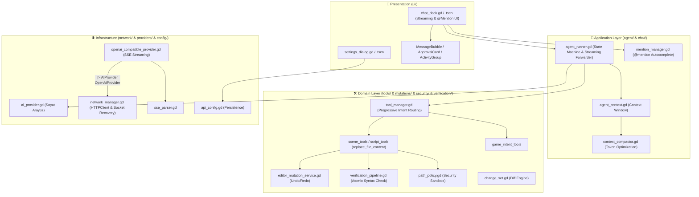

# 🏛️ Godot AI Core Architecture

Bu belge, **Godot AI Core (Godot AI Sidebar)** eklentisinin yazılım mimarisini, katmanlar arası bağımlılık kurallarını, veri akışını, soket yaşam döngüsünü ve güvenlik tasarımını detaylandırmaktadır.

---

## 🎯 Mimari İlkeler (Design Principles)

1. **Clean Architecture (Temiz Mimari):**
   * Bağımlılık yönü daima dıştan içe doğrudur.
   * `Presentation` (UI) asla doğrudan `Infrastructure` (ağ soketleri, HTTP istemcileri) ile konuşmaz.
   * `Domain` katmanı dış dünyadan tamamen izoledir.
2. **Single Responsibility Principle (1 Dosya = 1 İş):**
   * Her dosya yalnızca tek bir sorumluluğa sahiptir (`context_compactor.gd` sadece özetleme yapar; `mention_manager.gd` sadece `@mention` listesi tarar).
3. **Engine Safety & Complete Undo/Redo:**
   * Yapay zekanın yaptığı tüm sahne ve düğüm mutasyonları Godot'nun yerel `EditorUndoRedoManager` sistemine kayıtlıdır (**Ctrl + Z** desteği).
4. **Resilient Network & Graceful Socket Recovery:**
   * 9Router / OpenAI SSE akışlarında `finish_reason: "stop"` ve soket kapanışları (`Status: 8`) kayıpsız karşılanır ve kurtarılır.

---

## 📐 Katmanlı Mimari Şeması (Layer Diagram)



---

## 🧩 Katmanlar ve Sorumlulukları

### 1. 🎨 Presentation Katmanı (`ui/`)
* **[`chat_dock.gd`](addons/godot_sidebar_ai/ui/docks/chat_dock.gd):** Sol/sağ dock paneline yerleşen ana sohbet arayüzüdür. Canlı SSE token akışını sohbet baloncuğuna iletir, `@mention` açılır penceresini yönetir.
* **[`sidebar_theme.gd`](addons/godot_sidebar_ai/ui/theme/sidebar_theme.gd):** Merkezi tema motoru (`AISidebarTheme`). Semantik renk tokenları, tipografi ve tutarlı StyleBox tanımlarını barındırır.
* **[`message_bubble.gd`](addons/godot_sidebar_ai/ui/components/message_bubble.gd):** Metin seçimi (`selection_enabled`), `Ctrl+C` kısayolu ve akıcı BBCode link formatı sunan modüler mesaj baloncuğu.
* **[`approval_card.gd`](addons/godot_sidebar_ai/ui/components/approval_card.gd):** Dosya yazma/silme gibi kritik işlemlerde kullanıcıdan onay isteyen tek yüzeyli interaktif kart.
* **[`activity_group.gd`](addons/godot_sidebar_ai/ui/components/activity_group.gd):** Ajanın arka plan araç çağrılarını ve doğrulama adımlarını katlanabilir grupta toplayan bileşen.
* **[`history_panel.gd`](addons/godot_sidebar_ai/ui/components/history_panel.gd):** Geçmiş sohbet oturumlarını listeleme, arama ve yükleme paneli.

### 2. 🤖 Application Katmanı (`core/agent/` & `core/chat/`)
* **[`agent_runner.gd`](addons/godot_sidebar_ai/core/agent/agent_runner.gd):** Ajan durum makinesini (State Machine) yönetir (`IDLE ➔ PLANNING ➔ EXECUTING ➔ OBSERVING ➔ VERIFYING ➔ COMPLETED`).
* **[`context_compactor.gd`](addons/godot_sidebar_ai/core/agent/context_compactor.gd):** Eski araç çıktılarını 1-2 satırlık özetlere dönüştürerek token tasarrufu sağlar.
* **[`mention_manager.gd`](addons/godot_sidebar_ai/core/chat/mention_manager.gd):** `@` yazıldığında dosya ve sahne düğümlerini tarayıp güvenli context limitiyle prompta enjekte eder.

### 3. 🛠️ Domain Katmanı (`core/tools/`, `core/mutations/`, `core/security/`)
* **[`script_tools.gd`](addons/godot_sidebar_ai/core/tools/primitive/script_tools.gd):** Cerrahi kod düzenleme (`replace_file_content`), toplu dosya yazma (`write_files`) ve silme (`delete_file`).
* **[`editor_mutation_service.gd`](addons/godot_sidebar_ai/core/mutations/editor_mutation_service.gd):** Düğüm ekleme/silme ve özellik değişikliklerini `EditorUndoRedoManager`'a kaydeder.
* **[`verification_pipeline.gd`](addons/godot_sidebar_ai/core/verification/verification_pipeline.gd):** Diske yazılmadan önce GDScript sözdizimini derleme motoruyla doğrular.
* **[`ui_telemetry_tools.gd`](addons/godot_sidebar_ai/core/tools/telemetry/ui_telemetry_tools.gd):** Godot Control/Container hiyerarşisini, taşma ve tema detaylarını denetleyen telemetri motoru.

### 4. 🌐 Infrastructure Katmanı (`core/network/`, `core/providers/`)
* **[`network_manager.gd`](addons/godot_sidebar_ai/core/network/network_manager.gd):** Canlı SSE akışı ve soket kapanışı (`Status: 8`) kurtarma motoru. Windows loopback için `localhost` $\rightarrow$ `127.0.0.1` normalizasyonu ve `Connection: close` yönetimi.
* **[`openai_compatible_provider.gd`](addons/godot_sidebar_ai/core/providers/openai_compatible_provider.gd):** 9Router, OpenRouter, yerel Ollama ve LM Studio ile iletişim kuran sağlayıcı.

---

## 🧪 Test Mimarisi

Birim, mantık ve entegrasyon testleri üç ayrı seviyede koşulur:

1. **Headless GDScript Compilation & Scene Load Validation:**
```bash
powershell -ExecutionPolicy Bypass -File .\typecheck.ps1
```
*Tüm eklenti (`addons/godot_sidebar_ai/`) ve test (`tests/`) scriptlerini (113 GDScript, 4 Sahne) statik olarak yükleyip derleme hatalarını doğrular.*

2. **Headless Master Test Suite (54 Test Paketi / 291 Assertion):**
```bash
godot --headless --path . -s res://tests/test_runner.gd
```

3. **Canlı 9Router Entegrasyon Testi (Canlı Socket + Model Çağrısı):**
```bash
godot --headless --path . -s res://tests/integration/test_real_9router_live.gd
```
