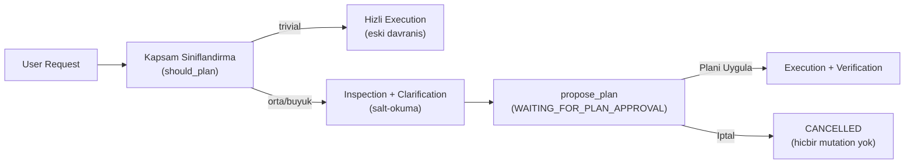

# 🏛️ Godot AI Core Architecture

Bu belge, **Godot AI Core (Godot AI Sidebar)** eklentisinin yazılım mimarisini, katmanlar arası bağımlılık kurallarını, veri akışını, soket yaşam döngüsünü ve güvenlik tasarımını detaylandırmaktadır.

---

## 🎯 Mimari İlkeler (Design Principles)

1. **Clean Architecture (Temiz Mimari):**
   * Bağımlılık yönü daima dıştan içe doğrudur.
   * `Presentation` (UI) asla doğrudan `Infrastructure` (ağ soketleri, HTTP istemcileri) ile konuşmaz.
   * `Domain` katmanı dış dünyadan tamamen izoledir.
2. **Single Responsibility Principle (1 Dosya = 1 İş):**
   * Her dosya yalnızca tek bir sorumluluğa sahiptir (`context_compactor.gd` sadece özetleme yapar; `mention_manager.gd` sadece `@mention` listesi tarar).
3. **Engine Safety & Complete Undo/Redo:**
   * Yapay zekanın yaptığı tüm sahne ve düğüm mutasyonları Godot'nun yerel `EditorUndoRedoManager` sistemine kayıtlıdır (**Ctrl + Z** desteği).
4. **Resilient Network & Graceful Socket Recovery:**
   * 9Router / OpenAI SSE akışlarında `finish_reason: "stop"` ve soket kapanışları (`Status: 8`) kayıpsız karşılanır ve kurtarılır.

---

## 📐 Katmanlı Mimari Şeması (Layer Diagram)

```mermaid
graph TD
    subgraph UI ["🎨 Presentation (ui/)"]
        ChatDock["chat_dock.gd / .tscn (Sahne bağlantısı + birimlerin kompozisyonu)"]
        Controllers["controllers/ (TaskController, ModelBarController, ChatSessionStore, ChatExportActions)"]
        Presenters["presenters/ (AgentStream / AgentActivity / AgentInteraction, MarkdownRenderer, ToolPresentation, SessionReplayRenderer, PlanChecklistTracker)"]
        UIComponents["components/ (MessageBubble, kartlar, ActivityGroup, TaskChecklist, InputComposer, MessageQueuePanel, StatusIcon, PendingIndicator)"]
        SettingsDialog["settings_dialog.gd / .tscn"]
        HistoryPanel["history_panel.gd (Session Drawer)"]
        Theme["sidebar_theme.gd (AISidebarTheme Design System)"]
    end

    subgraph Application ["🤖 Application Layer (core/agent/ & core/chat/ & core/commands/)"]
        AgentHost["agent_host.gd (Kompozisyon: NetworkManager + Provider + Context + Runner)"]
        AgentRunner["agent_runner.gd (State Machine & Streaming Forwarder)"]
        AgentTelemetry["agent_telemetry.gd (Sayaçlar, Süreler, Task Metrikleri)"]
        PendingInteraction["pending_interaction.gd (Bekleyen Onay / Soru / Plan)"]
        PlanningPolicy["planning_policy.gd (Kapsam Siniflandirici & Mutation Guard)"]
        AgentContext["agent_context.gd (Context Window)"]
        ContextCompactor["context_compactor.gd (Token Optimization)"]
        ChatManager["chat_manager.gd / chat_session.gd (Persistence)"]
        MentionManager["mention_manager.gd (@mention Autocomplete)"]
        SlashCommands["slash_command_manager.gd"]
    end

    subgraph Domain ["🛠️ Domain Layer (tools/ & mutations/ & security/ & verification/)"]
        ToolManager["tool_manager.gd (Progressive Intent Routing)"]
        PrimitiveTools["scene_tools / script_tools / editor_tools"]
        IntentTools["game_intent_tools"]
        UITelemetry["ui_telemetry_tools.gd (Layout Inspection)"]
        MutationService["editor_mutation_service.gd (Undo/Redo)"]
        VerificationPipeline["verification_pipeline.gd (Atomic Syntax Check)"]
        PathPolicy["path_policy.gd (Security Sandbox)"]
        PermissionPolicy["permission_policy.gd (Approval Classification)"]
        ChangeSet["change_set.gd (Diff Engine)"]
        ImplementationPlan["implementation_plan.gd (Plan Veri Modeli)"]
    end

    subgraph Runtime ["🐞 Runtime Inspection (core/runtime/)"]
        DebuggerPlugin["debugger_plugin.gd (EditorDebuggerPlugin)"]
        RuntimeBridge["runtime_bridge.gd (Game-side Autoload)"]
        RuntimeObserver["runtime_observer.gd"]
        SourceMapper["source_mapper.gd (Stack-trace Mapping)"]
    end

    subgraph Infrastructure ["🌐 Infrastructure (network/ & providers/ & config/ & state/)"]
        AIProvider["ai_provider.gd (Soyut Arayüz)"]
        OpenAIProvider["openai_compatible_provider.gd (SSE Streaming)"]
        AGYProvider["agy_cli_provider.gd (Antigravity CLI Subprocess)"]
        NetworkManager["network_manager.gd (HTTPClient & Socket Recovery)"]
        SSEParser["sse_parser.gd"]
        Config["api_config.gd (Persistence)"]
        EditorSnapshot["editor_state_snapshot.gd / context_collector.gd (Grounding)"]
    end

    ChatDock --> Controllers
    ChatDock --> Presenters
    ChatDock --> HistoryPanel
    ChatDock -.->|"attach_agent_host (plugin.gd enjekte eder)"| AgentHost
    AgentHost --> AgentRunner
    AgentHost --> AgentContext
    AgentHost --> AIProvider
    AgentHost --> NetworkManager
    AgentRunner -.->|"sinyaller"| Presenters
    AgentRunner -.->|"task_completed / error_occurred"| Controllers
    Controllers --> AgentRunner
    Controllers --> SlashCommands
    Controllers --> MentionManager
    Controllers --> ChatManager
    Presenters --> UIComponents
    UIComponents -.->|"AISidebarTheme tokens"| Theme
    SettingsDialog --> Config
    AgentRunner --> AgentContext
    AgentRunner --> AgentTelemetry
    AgentRunner --> PendingInteraction
    AgentRunner --> ToolManager
    AgentRunner --> AIProvider
    AgentRunner --> VerificationPipeline
    AgentRunner --> PlanningPolicy
    AgentContext --> ContextCompactor
    AgentContext --> EditorSnapshot
    ToolManager --> PrimitiveTools
    ToolManager --> IntentTools
    ToolManager --> UITelemetry
    PrimitiveTools --> MutationService
    PrimitiveTools --> PathPolicy
    PrimitiveTools --> PermissionPolicy
    PrimitiveTools --> VerificationPipeline
    OpenAIProvider --|> AIProvider
    AGYProvider --|> AIProvider
    OpenAIProvider --> NetworkManager
    OpenAIProvider --> SSEParser
    DebuggerPlugin --> RuntimeBridge
    RuntimeBridge --> RuntimeObserver
    RuntimeObserver --> SourceMapper
    SourceMapper --> AgentContext
```

---

## 🧩 Katmanlar ve Sorumlulukları

Giriş noktası ve kompozisyon kökü: [`plugin.gd`](addons/godot_sidebar_ai/plugin.gd) eklentiyi etkinleştirir, ajan katmanını (`AgentHost`) kurup dock'a enjekte eder, dock'u editöre yerleştirir ve runtime debugger köprüsünü kaydeder. UI provider veya `NetworkManager` oluşturmaz.

### 1. 🎨 Presentation Katmanı (`ui/`)

AgentRunner sinyallerini presenter'lar dinler; görev akışını controller'lar yönetir; ChatDock yalnızca sahne düğümlerini bağlar ve birimleri birbirine kompoze eder. Bileşenler (`components/`) veri bilmez, yalnızca görünümdür. Faz 1 refactor'ının gerekçesi: `docs/REFACTOR_PLAN.md`.

**Dock (kompozisyon)**
* **[`chat_dock.gd`](addons/godot_sidebar_ai/ui/docks/chat_dock.gd):** Sahne referansları, birimlerin kurulumu ve bağlanması (`attach_agent_host` → `_connect_agent_runner`), dil/ikon yenileme ve sohbet gezinmesi (New, History yükleme, Clear, karşılama kartı). Provider'a doğrudan dokunmaz; model listesi ve AGY hazırlık olaylarını `AgentHost`'tan dinler, ayar kaydında provider'ı host'a yeniden kurdurur.
* **[`chat_dock_theme.gd`](addons/godot_sidebar_ai/ui/docks/chat_dock_theme.gd):** ChatDock sahne düğümlerine tema ve stil uygular; mantık içermez.

**Controllers (akış ve durum)**
* **[`task_controller.gd`](addons/godot_sidebar_ai/ui/controllers/task_controller.gd):** Girişten gönderme (slash komut / kuyruk / "devam et" / yeni task), task başlatma ve devam ettirme, kuyruk dağıtımı, pause checkpoint + Paused rozeti, task bitişi ve hata orkestrasyonu.
* **[`model_bar_controller.gd`](addons/godot_sidebar_ai/ui/controllers/model_bar_controller.gd):** Model listesi (önbellek + provider), seçili modelin kaydı, onay modu butonu (MANUAL → AUTO → FULL_AUTO; `approve_mode_spec` ile ikon + renkli hap). Onay modu yalnızca bu butonda görünür, durum rozeti tekrar etmez.
* **[`chat_session_store.gd`](addons/godot_sidebar_ai/ui/controllers/chat_session_store.gd):** Aktif oturumun kalıcı durumu (UI yok): kaydet/yükle, temizle, pause checkpoint.
* **[`chat_export_actions.gd`](addons/godot_sidebar_ai/ui/controllers/chat_export_actions.gd):** Export (md + json), Copy Chat, task başına kopyalama ve History panelinden eski oturum export'u.

**Presenters (AgentRunner sinyalleri → görünüm)**
* **[`agent_stream_presenter.gd`](addons/godot_sidebar_ai/ui/presenters/agent_stream_presenter.gd):** Streaming asistan balonu, tool-call zarfı süzme, thinking / eylem özeti kartları, bekleme sayacı, bekleme göstergesi ve durum rozeti.
* **[`agent_activity_presenter.gd`](addons/godot_sidebar_ai/ui/presenters/agent_activity_presenter.gd):** Activity grubu, tool çalıştırma/tamamlama satırları, doğrulama, runtime gözlemi, otomatik teşhis, adım ilerlemesi, AI ekran görüntüsü önizlemesi.
* **[`agent_interaction_presenter.gd`](addons/godot_sidebar_ai/ui/presenters/agent_interaction_presenter.gd):** Kullanıcı kararı isteyen kartlar: netleştirme, tool onayı, plan (onay → checklist), değişiklikler, diff ve undo.
* **[`markdown_renderer.gd`](addons/godot_sidebar_ai/ui/presenters/markdown_renderer.gd):** Saf Markdown → BBCode dönüştürücü; köşeli parantezleri kaçırır (metin BBCode enjekte edemez), kod blokları tek kutu + eş genişlikli yazı tipi.
* **[`tool_presentation.gd`](addons/godot_sidebar_ai/ui/presenters/tool_presentation.gd):** Tool adları için insan okunur başlıklar, teknik detay metni, hata özeti, runtime hata özeti.
* **[`session_replay_renderer.gd`](addons/godot_sidebar_ai/ui/presenters/session_replay_renderer.gd):** History'den yüklenen oturumu kart akışı olarak yeniden kurar.
* **[`plan_checklist_tracker.gd`](addons/godot_sidebar_ai/ui/presenters/plan_checklist_tracker.gd):** Onaylı planın adımlarını tool olaylarıyla deterministik olarak eşleyip ilerletir.

**Components (görünüm)**
* **[`message_bubble.gd`](addons/godot_sidebar_ai/ui/components/message_bubble.gd):** Rol bazlı mesaj balonu; seçilebilir metin, kopyalama, Markdown ve `res://` bağlantıları.
* **[`approval_card.gd`](addons/godot_sidebar_ai/ui/components/approval_card.gd):** Dosya yazma/silme gibi riskli işlemlerde kullanıcıdan onay isteyen kart.
* **[`clarification_card.gd`](addons/godot_sidebar_ai/ui/components/clarification_card.gd):** Ajan kritik bir belirsizlikte durduğunda (`WAITING_FOR_CLARIFICATION`) gösterilen soru kartı; seçenek butonları ve serbest metin.
* **[`plan_card.gd`](addons/godot_sidebar_ai/ui/components/plan_card.gd):** Implementation planını (`WAITING_FOR_PLAN_APPROVAL`) gösterir; `[Planı Uygula]` / `[İptal]` kararını toplar.
* **[`task_checklist.gd`](addons/godot_sidebar_ai/ui/components/task_checklist.gd):** Onaylı planın yüksek seviye adım listesi (ActivityGroup'tan ayrı).
* **[`activity_group.gd`](addons/godot_sidebar_ai/ui/components/activity_group.gd):** Tool çağrılarını ve doğrulama adımlarını katlanabilir grupta toplar.
* **[`changes_card.gd`](addons/godot_sidebar_ai/ui/components/changes_card.gd):** Uygulanan değişiklikleri (+/- satır) gösterir; `[View Diff]` ve `[Undo]`.
* **[`runtime_card.gd`](addons/godot_sidebar_ai/ui/components/runtime_card.gd):** Oyun çalıştırma ve runtime hata sonuçları.
* **[`telemetry_card.gd`](addons/godot_sidebar_ai/ui/components/telemetry_card.gd):** Task sonu tek satır özet; tıklayınca süre dökümü, task kopyalama.
* **[`error_card.gd`](addons/godot_sidebar_ai/ui/components/error_card.gd):** Hata kartı ve Retry butonu.
* **[`reasoning_card.gd`](addons/godot_sidebar_ai/ui/components/reasoning_card.gd):** Eylem özeti paneli ("Model ne yapıyor?"); ham reasoning göstermez.
* **[`thinking_card.gd`](addons/godot_sidebar_ai/ui/components/thinking_card.gd):** Provider'ın gönderdiği thinking metni; varsayılan kapalı.
* **[`screenshot_card.gd`](addons/godot_sidebar_ai/ui/components/screenshot_card.gd):** AI ekran görüntüsü önizlemesi (thumbnail, kaynak, görsel gönderim durumu).
* **[`welcome_card.gd`](addons/godot_sidebar_ai/ui/components/welcome_card.gd):** Boş sohbette hızlı başlangıç önerileri.
* **[`pending_indicator.gd`](addons/godot_sidebar_ai/ui/components/pending_indicator.gd):** İlk model yanıtı beklenirken akışın sonundaki canlı gösterge (aşama + süre, iptal ipucu).
* **[`input_composer.gd`](addons/godot_sidebar_ai/ui/components/input_composer.gd):** Giriş alanı davranışı: Enter / Shift+Enter / Ctrl+V, `@` ve `/` autocomplete, pano görseli eki.
* **[`message_queue_panel.gd`](addons/godot_sidebar_ai/ui/components/message_queue_panel.gd):** Ajan çalışırken gönderilen mesajların FIFO kuyruğu ve paneli.
* **[`history_panel.gd`](addons/godot_sidebar_ai/ui/components/history_panel.gd):** Geçmiş oturumları listeleme, arama, yeniden adlandırma, silme, export.
* **[`status_icon.gd`](addons/godot_sidebar_ai/ui/components/status_icon.gd):** Durum glifini (✓ ✕ ▶ ! ☐) boyalı Lucide ikonuna çevirir; glif veride aynen kalır.
* **[`icon_helper.gd`](addons/godot_sidebar_ai/ui/components/icon_helper.gd):** Lucide SVG yükleme ve renge boyama (`get_tinted_icon`); import sistemine bağlı değildir.

**Dialogs ve tema**
* **[`settings_dialog.gd`](addons/godot_sidebar_ai/ui/dialogs/settings_dialog.gd):** Provider, API, model, dil ve güvenlik ayarları.
* **[`change_set_dialog.gd`](addons/godot_sidebar_ai/ui/dialogs/change_set_dialog.gd):** Değişiklik ve diff görüntüleme / onay penceresi.
* **[`sidebar_theme.gd`](addons/godot_sidebar_ai/ui/theme/sidebar_theme.gd):** Merkezi tema (`AISidebarTheme`): semantik renk tokenları, tipografi, StyleBox fabrikaları.

### 2. 🤖 Application Katmanı (`core/agent/`, `core/chat/`, `core/commands/`)
* **[`agent_host.gd`](addons/godot_sidebar_ai/core/agent/agent_host.gd):** Ajan katmanının kompozisyon birimi. `NetworkManager`, provider, `AgentContext` ve `AgentRunner`'ın sahibidir; provider'ı config'e göre kurar (`create_provider`, `rebuild_provider`: eski alt süreç durdurulur, eski provider `dispose()` ile ortak NetworkManager'dan ayrılır, yeni provider ısıtılır, runner ona geçer), model listesi ve hazırlık olaylarını UI'a aktarır. `plugin.gd` kurar ve dock'a enjekte eder; testler `set_provider` ile sahte provider bağlar.
* **[`agent_runner.gd`](addons/godot_sidebar_ai/core/agent/agent_runner.gd):** Ajan durum makinesini (State Machine) yönetir (`IDLE ➔ PLANNING ➔ EXECUTING ➔ OBSERVING ➔ VERIFYING ➔ COMPLETED`, ayrıca `WAITING_FOR_APPROVAL`, `WAITING_FOR_CLARIFICATION` ve `WAITING_FOR_PLAN_APPROVAL`).
* **[`agent_telemetry.gd`](addons/godot_sidebar_ai/core/agent/agent_telemetry.gd):** Runner başına görev telemetrisi: tool / LLM / bekleme sayaçları ve süreleri, read/search/write ayrımı, okunan / yazılan dosya kümeleri, tool türü sınıflandırması (`classify_tool_kind`) ve task sonu metrik sözlüğü (`build_metrics`; anahtar sırası export ve telemetri kartı için sabit). Karar vermez, sinyal yaymaz.
* **[`pending_interaction.gd`](addons/godot_sidebar_ai/core/agent/pending_interaction.gd):** Runner başına bekleyen kullanıcı kararları: onay bekleyen tool çağrısı (ad, kimlik, argümanlar, change set), netleştirme sorusu (`ask_user`) ve onay bekleyen plan (`propose_plan`). İstek saklama, tek seferlik tüketme (`take_*`) ve temizlik; durum geçişleri ve context kaydı runner'dadır.
* **[`planning_policy.gd`](addons/godot_sidebar_ai/core/agent/planning_policy.gd):** Uygulama planlama katmanının **deterministik** karar merkezi. Modelin davranışına bırakılmadan (a) bir isteğin plan gerektirip gerektirmediğini sınıflandırır (`should_plan`), (b) plan fazında hangi araçların engelleneceğini belirler (`is_mutation_blocked`, fail-closed). Risk listesi tekrar yazılmaz; `PermissionPolicy` risk kayıt defteri tek doğruluk kaynağı olarak kullanılır.
* **[`context_compactor.gd`](addons/godot_sidebar_ai/core/agent/context_compactor.gd):** Eski araç çıktılarını 1-2 satırlık özetlere dönüştürerek token tasarrufu sağlar.
* **[`chat_manager.gd`](addons/godot_sidebar_ai/core/chat/chat_manager.gd) / [`chat_session.gd`](addons/godot_sidebar_ai/core/chat/chat_session.gd):** Oturum kalıcılığı. Konuşmalar projeye bağlı `user://sidebar_ai_chats/` dizininde izole JSON dosyaları olarak saklanır; API anahtarı veya token asla diske yazılmaz.
* **[`mention_manager.gd`](addons/godot_sidebar_ai/core/chat/mention_manager.gd):** `@` yazıldığında dosya ve sahne düğümlerini tarayıp güvenli context limitiyle prompta enjekte eder.
* **[`slash_command_manager.gd`](addons/godot_sidebar_ai/core/commands/slash_command_manager.gd):** `/` ile başlayan hızlı komutları çözümler.
* **[`completion_policy.gd`](addons/godot_sidebar_ai/core/agent/completion_policy.gd):** Tamamlanma bütünlüğü kapısı (saf/deterministik): model "bitti" dedi diye task başarılı sayılmaz; runtime kanıtı gerekir, yoksa `needs review`.
* **[`task_transcript.gd`](addons/godot_sidebar_ai/core/chat/task_transcript.gd):** Görev bazlı tam transcript deposu; `agent_context.messages` compact edilse de bu depo ASLA budanmaz ve export'un tek kaynağıdır.
* **[`task_checkpoint.gd`](addons/godot_sidebar_ai/core/chat/task_checkpoint.gd):** Pause / resume checkpoint modeli; transcript'ten türetilir, "devam et" aynı task'ı kaldığı adımdan sürdürür.
* **[`chat_exporter.gd`](addons/godot_sidebar_ai/core/chat/chat_exporter.gd):** Konuşmayı, tool çağrılarını, diff'leri, runtime hatalarını ve telemetriyi Markdown + JSON olarak dışa aktarır.
* **[`i18n.gd`](addons/godot_sidebar_ai/core/i18n/i18n.gd):** TR / EN sözlüğü ve `get_text(key, params)`.

### 3. 🛠️ Domain Katmanı (`core/tools/`, `core/mutations/`, `core/security/`, `core/verification/`)
* **[`script_tools.gd`](addons/godot_sidebar_ai/core/tools/primitive/script_tools.gd):** Cerrahi kod düzenleme (`replace_file_content`), toplu dosya yazma (`write_files`) ve silme (`delete_file`).
* **[`editor_mutation_service.gd`](addons/godot_sidebar_ai/core/mutations/editor_mutation_service.gd):** Düğüm ekleme/silme ve özellik değişikliklerini `EditorUndoRedoManager`'a kaydeder.
* **[`verification_pipeline.gd`](addons/godot_sidebar_ai/core/verification/verification_pipeline.gd):** Diske yazılmadan önce GDScript sözdizimini derleme motoruyla doğrular.
* **[`permission_policy.gd`](addons/godot_sidebar_ai/core/security/permission_policy.gd):** İşlemleri yetki sınıflarına ayırır ve `MANUAL` / `AUTO` / `FULL_AUTO` onay moduna göre kullanıcı onayı gerekip gerekmediğine karar verir.
* **[`ui_telemetry_tools.gd`](addons/godot_sidebar_ai/core/tools/primitive/ui_telemetry_tools.gd):** Godot Control/Container hiyerarşisini, taşma ve tema detaylarını denetleyen telemetri motoru.
* **[`implementation_plan.gd`](addons/godot_sidebar_ai/core/types/implementation_plan.gd):** Kullanıcıya gösterilen planın veri modeli. Planı yapılandırılmış alanlardan (`goal`, `affected_files`, `steps`, `dependencies`, `verification`, `risks`) üretir ve Markdown artifact'a çevirir. **Modelin gizli reasoning'i bu modele hiç girmez.**

### 3.1 📋 Uygulama Planlama Katmanı (Implementation Planning Layer)

Orta/büyük kapsamlı isteklerde ajan doğrudan araç çağrılarına geçmez:



* **Ayrim:** `Clarification` ile `Planning` aynı şey değildir. Clarification kritik mimari belirsizliği çözer; plan ise ondan SONRA somut adımları sunar.
* **`propose_plan` bir araçtır:** `ask_user` ile birebir aynı intercept deseniyle yakalanır; çalıştırılmaz, kullanıcıya sunulur. Böylece LLM'in serbest metni parse edilmez.
* **Plan/Execution ayrımı:** Plan fazında yalnızca salt-okuma araçları şemada sunulur ve `is_mutation_blocked` guard'ı değiştirici çağrıları deterministik olarak reddeder. Plan reddedilirse hiçbir mutation yapılmamış olur.
* **Onay anlamı:** Plan onayı **niyet** onayıdır; riskli araçlar execution sırasında yine tek tek `ApprovalCard` ile onaylanır.

### 3.2 🧱 Ortak Tipler ve Temel Sınıflar (`core/types/`, `core/tools/tool_base.gd`)
* **[`tool_base.gd`](addons/godot_sidebar_ai/core/tools/tool_base.gd):** Tüm araç modüllerinin soyut temel sınıfı.
* **[`tool_result.gd`](addons/godot_sidebar_ai/core/types/tool_result.gd):** Standart araç sonucu (başarı / hata) modeli.
* **[`type_parser.gd`](addons/godot_sidebar_ai/core/types/type_parser.gd):** Metin olarak gelen değerleri (`Vector2(100, 200)`, `#ff0000`, `true`) Godot Variant tiplerine çevirir.
* **[`runtime_observation.gd`](addons/godot_sidebar_ai/core/types/runtime_observation.gd):** Oyun sürecinden toplanan hata, uyarı ve stack trace verisinin modeli; epistemik durum ayrımı (ERROR_DETECTED, CRASHED, VERIFIED_CLEAN...).
* **[`vision_input.gd`](addons/godot_sidebar_ai/core/types/vision_input.gd):** Multimodal modellere gönderilen görsel (Base64 / PNG) modeli.
* **[`visual_observation.gd`](addons/godot_sidebar_ai/core/types/visual_observation.gd):** Görsel teşhis sonucu, tespit edilen sorunlar ve güven skoru modeli.

### 4. 🐞 Runtime Inspection Katmanı (`core/runtime/`)
* **[`runtime_debugger.gd`](addons/godot_sidebar_ai/core/runtime/runtime_debugger.gd):** Oyunu başlatır/durdurur, artımlı logları izler ve `RuntimeObservation` üretir.
* **[`debugger_plugin.gd`](addons/godot_sidebar_ai/core/runtime/debugger_plugin.gd):** `EditorDebuggerPlugin` tabanlı köprü; editör ile çalışan oyun arasında mesaj kanalı kurar.
* **[`runtime_bridge.gd`](addons/godot_sidebar_ai/core/runtime/runtime_bridge.gd):** Oyun tarafına autoload olarak eklenen karşı taraf; canlı sahne ağacı ve düğüm özelliklerini sorgulanabilir kılar (`inspect_runtime_tree`, `inspect_runtime_node`).
* **[`runtime_observer.gd`](addons/godot_sidebar_ai/core/runtime/runtime_observer.gd):** Çalışma zamanı hatalarını gözlemler ve `RuntimeObservation` modeline dönüştürür.
* **[`source_mapper.gd`](addons/godot_sidebar_ai/core/runtime/source_mapper.gd):** Stack trace girdilerini projedeki gerçek kaynak dosya ve satırlara eşler; self-healing döngüsünün doğru scripti bulmasını sağlar.

### 5. 🌐 Infrastructure Katmanı (`core/network/`, `core/providers/`, `core/state/`)
* **[`network_manager.gd`](addons/godot_sidebar_ai/core/network/network_manager.gd):** Canlı SSE akışı ve soket kapanışı (`Status: 8`) kurtarma motoru. Windows loopback için `localhost` $\rightarrow$ `127.0.0.1` normalizasyonu ve `Connection: close` yönetimi.
* **[`openai_compatible_provider.gd`](addons/godot_sidebar_ai/core/providers/openai_compatible_provider.gd):** 9Router, OpenRouter, yerel Ollama ve LM Studio ile iletişim kuran sağlayıcı. Vision yeteneği, diskten bağımsız çalışan saf `model_supports_vision()` fonksiyonu ile belirlenir ve `vision_capable` ayarıyla geçersiz kılınabilir.
* **[`agy_cli_provider.gd`](addons/godot_sidebar_ai/core/providers/agy_cli_provider.gd):** Resmi Google Antigravity CLI'ını (`agy`) kalıcı alt süreç olarak çalıştırır; çift yönlü NDJSON akışıyla HTTP katmanı olmadan doğrudan oturum açar. Görsel (Vision) girdisini desteklemez.
* **[`diagnosis_context.gd`](addons/godot_sidebar_ai/core/state/diagnosis_context.gd):** Editör durumu, runtime logları, görsel gözlem ve son değişiklikleri birleştirerek teşhis bağlamı kurar.
* **[`editor_state_snapshot.gd`](addons/godot_sidebar_ai/core/state/editor_state_snapshot.gd) / [`context_collector.gd`](addons/godot_sidebar_ai/core/state/context_collector.gd):** Aktif sahne, seçili düğüm ve açık script gibi editör durumunu toplayıp prompt bağlamına (grounding) ekler.

---

## 🧪 Test Mimarisi

Birim, mantık ve entegrasyon testleri üç ayrı seviyede koşulur:

1. **Headless GDScript Compilation & Scene Load Validation:**
```bash
powershell -ExecutionPolicy Bypass -File .\typecheck.ps1
```
*Tüm eklenti (`addons/godot_sidebar_ai/`) ve test (`tests/`) scriptlerini ve sahneleri statik olarak yükleyip derleme hatalarını doğrular. Güncel dosya sayısı komut çıktısındadır.*

2. **Headless Master Test Suite (güncel paket / assertion sayısı `verify.ps1` çıktısındadır):**
```bash
godot --headless --path . -s res://tests/test_runner.gd
```

3. **Planlama Akışı Uçtan Uca Entegrasyon Testi (deterministik, LLM'siz):**
```bash
godot --headless --path . -s res://tests/integration/test_planning_flow.gd
```

4. **Canlı 9Router Entegrasyon Testi (Canlı Socket + Model Çağrısı):**
```bash
godot --headless --path . -s res://tests/integration/test_real_9router_live.gd
```
