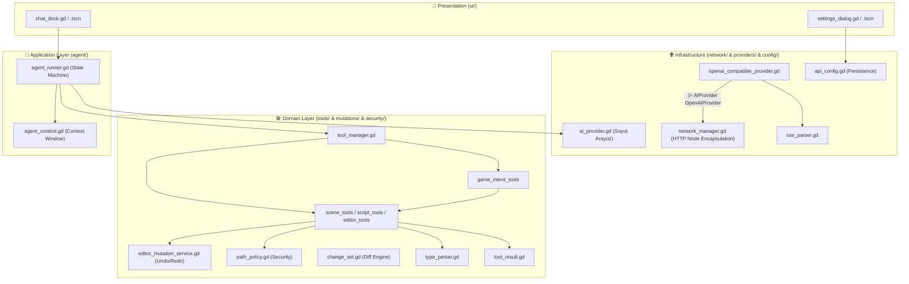

# 🏛️ Godot AI Core Architecture

Bu belge, **Godot AI Core (Godot AI Sidebar v2.0)** eklentisinin yazılım mimarisini, katmanlar arası bağımlılık kurallarını, veri akışını ve güvenlik tasarımını detaylandırmaktadır.

---

## 🎯 Mimari İlkeler (Design Principles)

1. **Clean Architecture (Temiz Mimari):**
   * Bağımlılık yönü daima dıştan içe (veya altyapıdan soyutlamaya) doğrudur.
   * `Presentation` asla doğrudan `Infrastructure` (ağ soketleri, HTTP istemcileri vb.) ile konuşmaz.
   * `Domain` katmanı dış dünyadan tamamen izoledir.
2. **Single Responsibility Principle (1 Dosya = 1 İş):**
   * Her dosya yalnızca tek bir sorumluluğa sahiptir (Örn: `type_parser.gd` sadece tip dönüşümü yapar; `path_policy.gd` sadece yol güvenliğini denetler).
3. **Engine Safety & Complete Undo/Redo:**
   * Yapay zekanın yaptığı tüm sahne ve düğüm mutasyonları Godot'nun yerel `EditorUndoRedoManager` sistemine kayıtlıdır (**Ctrl + Z** desteği).
4. **Provider Abstraction:**
   * Çekirdek hiçbir model sağlayıcısına (9Router, OpenAI, Anthropic, Ollama) sıkı sıkıya bağlı (tightly coupled) değildir.

---

## 📐 Katmanlı Mimari Şeması (Layer Diagram)



---

## 🧩 Katmanlar ve Sorumlulukları

### 1. 🎨 Presentation Katmanı (`ui/`)
* **[`chat_dock.gd`](file:///C:/Users/Halil%20Emre/Desktop/GitHub/Private/Godot%20AI%20Sidebar/addons/godot_sidebar_ai/ui/docks/chat_dock.gd):** Sol dock panelindeki sohbet arayüzüdür. Kullanıcı girdilerini alır, `AgentRunner` sinyallerini dinler ve metin/thinking/araç sonuçlarını biçimlendirerek ekrana basar. **İçinde hiçbir HTTP düğümü veya ağ mantığı barındırmaz.**
* **[`settings_dialog.gd`](file:///C:/Users/Halil%20Emre/Desktop/GitHub/Private/Godot%20AI%20Sidebar/addons/godot_sidebar_ai/ui/dialogs/settings_dialog.gd):** API adresi, anahtarlar, sıcaklık ve ajan döngü limitini yapılandıran modal penceredir.

### 2. 🤖 Application Katmanı (`core/agent/`)
* **[`agent_runner.gd`](file:///C:/Users/Halil%20Emre/Desktop/GitHub/Private/Godot%20AI%20Sidebar/addons/godot_sidebar_ai/core/agent/agent_runner.gd):** Ajan durum makinesini (State Machine) yönetir.
  * **Durumlar:** `IDLE` ➔ `PLANNING` ➔ `EXECUTING` ➔ `OBSERVING` ➔ `VERIFYING` ➔ `COMPLETED` (Hata durumunda `ERROR`, `RECOVERING`, `CANCELLED`).
  * **Stagnation Koruması:** Modelin aynı parametrelerle aynı aracı 3 kez art arda çağırıp sonsuz döngüye girmesini engeller.
* **[`agent_context.gd`](file:///C:/Users/Halil%20Emre/Desktop/GitHub/Private/Godot%20AI%20Sidebar/addons/godot_sidebar_ai/core/agent/agent_context.gd):** Konuşma geçmişi dizisini ve ilk promptta editör zemin bilgisini (`EditorStateSnapshot`) toplar.

### 3. 🛠️ Domain Katmanı (`core/tools/`, `core/mutations/`, `core/security/`, `core/types/`)
* **[`editor_mutation_service.gd`](file:///C:/Users/Halil%20Emre/Desktop/GitHub/Private/Godot%20AI%20Sidebar/addons/godot_sidebar_ai/core/mutations/editor_mutation_service.gd):** Editördeki tüm mutasyonları (`add_node`, `delete_node`, `set_property`, `connect_signal`, `attach_script`, `reparent_node`) `EditorUndoRedoManager` üzerinden yürüten merkezi servistir.
* **[`path_policy.gd`](file:///C:/Users/Halil%20Emre/Desktop/GitHub/Private/Godot%20AI%20Sidebar/addons/godot_sidebar_ai/core/security/path_policy.gd):** Dosya güvenliği politikası. `project.godot`, `.git/**` ve eklenti dosyalarını korur, `../` traversal girişimlerini engeller.
* **[`tool_manager.gd`](file:///C:/Users/Halil%20Emre/Desktop/GitHub/Private/Godot%20AI%20Sidebar/addons/godot_sidebar_ai/core/tools/tool_manager.gd):** İlkel (primitive) ve yüksek seviyeli (intent) araçların kaydını tutar, `search_tools` ile progressive discovery sağlar.
* **[`change_set.gd`](file:///C:/Users/Halil%20Emre/Desktop/GitHub/Private/Godot%20AI%20Sidebar/addons/godot_sidebar_ai/core/types/change_set.gd):** Kod değişiklikleri için `+` ve `-` satır bazlı Diff üreten nesne modelidir.
* **[`type_parser.gd`](file:///C:/Users/Halil%20Emre/Desktop/GitHub/Private/Godot%20AI%20Sidebar/addons/godot_sidebar_ai/core/types/type_parser.gd):** `Vector2`, `Vector3`, `Color`, sayı ve boolean metinlerini güvenle Godot Variant tiplerine dönüştürür.
* **[`tool_result.gd`](file:///C:/Users/Halil%20Emre/Desktop/GitHub/Private/Godot%20AI%20Sidebar/addons/godot_sidebar_ai/core/types/tool_result.gd):** Standart `ok()` ve `err(code, msg, recoverable)` çıktı yapısı.

### 4. 🌐 Infrastructure Katmanı (`core/network/`, `core/providers/`, `core/config/`)
* **[`network_manager.gd`](file:///C:/Users/Halil%20Emre/Desktop/GitHub/Private/Godot%20AI%20Sidebar/addons/godot_sidebar_ai/core/network/network_manager.gd):** `HTTPRequest` düğümlerini kendi içinde yöneten, iptal ve zaman aşımı mekanizmasına sahip saf ağ bileşeni.
* **[`ai_provider.gd`](file:///C:/Users/Halil%20Emre/Desktop/GitHub/Private/Godot%20AI%20Sidebar/addons/godot_sidebar_ai/core/providers/ai_provider.gd):** Soyut sağlayıcı arayüzü.
* **[`openai_compatible_provider.gd`](file:///C:/Users/Halil%20Emre/Desktop/GitHub/Private/Godot%20AI%20Sidebar/addons/godot_sidebar_ai/core/providers/openai_compatible_provider.gd):** 9Router, OpenRouter, yerel Ollama ve LM Studio ile iletişim kuran sağlayıcı uygulaması.
* **[`sse_parser.gd`](file:///C:/Users/Halil%20Emre/Desktop/GitHub/Private/Godot%20AI%20Sidebar/addons/godot_sidebar_ai/core/network/sse_parser.gd):** Server-Sent Events akışlarını, thinking içeriklerini ve araç çağrılarını ayrıştırır.

---

## 🔄 Ajan Döngüsü (Agent Execution Flow)

```text
[Kullanıcı İstek Girer]
         │
         ▼
[EditorStateSnapshot] ──> Aktif sahne & seçili düğümler bağlama eklenir
         │
         ▼
[AgentRunner: PLANNING] ──> Model Sağlayıcıya (Provider) gönderilir
         │
         ▼
[Model Yanıtı Gelir]
   ├── Thinking (Düşünce) ──> UI'da Thinking kutusuna basılır
   ├── Metin Yanıtı ───────> Sohbet paneline eklenir
   └── Tool Calls (Varsa) ─> [AgentRunner: EXECUTING]
                                  │
                                  ▼
                         [PathPolicy / Sandbox Kontrolü]
                                  │
                                  ▼
                         [MutationService / UndoRedo Kaydı]
                                  │
                                  ▼
                         [Tool Çıktısı Context'e Eklenir]
                                  │
                                  ▼
                         [AgentRunner: OBSERVING ➔ Bir Sonraki Adım]
```

---

## 🧪 Test Mimarisi

Birim testler hiçbir editör arayüzüne ihtiyaç duymadan, Godot 4.7'nin headless CLI motoruyla çalıştırılır:

```bash
godot --headless -s res://tests/test_runner.gd
```

Test paketleri:
1. `test_type_parser.gd` (Variant ve string dönüşümleri)
2. `test_path_policy.gd` (Traversal engelleme ve korumalı dosya kalkanı)
3. `test_change_set.gd` (Diff motoru doğrulaması)
4. `test_sse_parser.gd` (SSE ve thinking blok ayrıştırma)
5. `test_tool_manager.gd` (Progressive discovery `search_tools`)
6. `test_agent_context.gd` (Bağlam ve zemin durumu)
7. `test_agent_runner_state.gd` (Ajan durum geçişleri)
