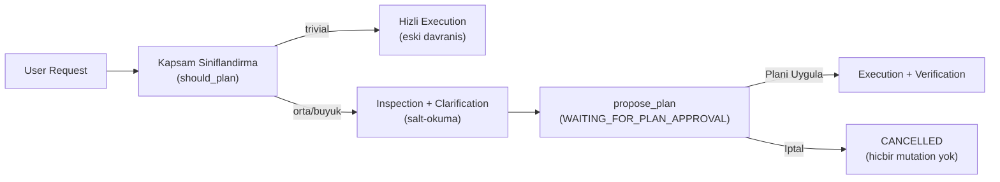

# 🏛️ Godot AI Core Architecture

Bu belge, **Godot AI Core (Godot AI Sidebar)** eklentisinin yazılım mimarisini, katmanlar arası bağımlılık kurallarını, veri akışını, soket yaşam döngüsünü ve güvenlik tasarımını detaylandırmaktadır.

---

## 🎯 Mimari İlkeler (Design Principles)

1. **Clean Architecture (Temiz Mimari):**
   * Bağımlılık yönü daima dıştan içe doğrudur.
   * `Presentation` (UI) asla doğrudan `Infrastructure` (ağ soketleri, HTTP istemcileri) ile konuşmaz.
   * `Domain` katmanı dış dünyadan tamamen izoledir.
2. **Single Responsibility Principle (1 Dosya = 1 İş):**
   * Her dosya yalnızca tek bir sorumluluğa sahiptir (`context_compactor.gd` sadece özetleme yapar; `mention_manager.gd` sadece `@mention` listesi tarar).
3. **Engine Safety & Complete Undo/Redo:**
   * Yapay zekanın yaptığı tüm sahne ve düğüm mutasyonları Godot'nun yerel `EditorUndoRedoManager` sistemine kayıtlıdır (**Ctrl + Z** desteği).
4. **Resilient Network & Graceful Socket Recovery:**
   * 9Router / OpenAI SSE akışlarında `finish_reason: "stop"` ve soket kapanışları (`Status: 8`) kayıpsız karşılanır ve kurtarılır.

---

## 📐 Katmanlı Mimari Şeması (Layer Diagram)

```mermaid
graph TD
    subgraph UI ["🎨 Presentation (ui/)"]
        ChatDock["chat_dock.gd / .tscn (Sahne bağlantısı + birimlerin kompozisyonu)"]
        Controllers["controllers/ (TaskController, ModelBarController, ChatSessionStore, ChatExportActions)"]
        Presenters["presenters/ (AgentStream / AgentActivity / AgentInteraction, MarkdownRenderer, ToolPresentation, SessionReplayRenderer, PlanChecklistTracker)"]
        UIComponents["components/ (MessageBubble, kartlar, ActivityGroup, TaskChecklist, InputComposer, MessageQueuePanel, StatusIcon, PendingIndicator)"]
        SettingsDialog["settings_dialog.gd / .tscn"]
        HistoryPanel["history_panel.gd (Session Drawer)"]
        Theme["sidebar_theme.gd (AISidebarTheme Design System)"]
    end

    subgraph Application ["🤖 Application Layer (core/agent/ & core/chat/ & core/commands/)"]
        AgentHost["agent_host.gd (Kompozisyon: NetworkManager + Provider + Context + Runner)"]
        AgentRunner["agent_runner.gd (State Machine & Streaming Forwarder)"]
        AgentTelemetry["agent_telemetry.gd (Sayaçlar, Süreler, Task Metrikleri)"]
        PendingInteraction["pending_interaction.gd (Bekleyen Onay / Soru / Plan)"]
        PlanningPolicy["planning_policy.gd (Mutation Guard)"]
        AgentContext["agent_context.gd (Context Window)"]
        ContextCompactor["context_compactor.gd (Token Optimization)"]
        ChatManager["chat_manager.gd / chat_session.gd (Persistence)"]
        MentionManager["mention_manager.gd (@mention Autocomplete)"]
        SlashCommands["slash_command_manager.gd"]
    end

    subgraph Domain ["🛠️ Domain Layer (tools/ & mutations/ & security/ & verification/)"]
        ToolManager["tool_manager.gd (Progressive Intent Routing)"]
        PrimitiveTools["scene_tools / script_tools / editor_tools"]
        IntentTools["game_intent_tools"]
        UITelemetry["ui_telemetry_tools.gd (Layout Inspection)"]
        MutationService["editor_mutation_service.gd (Undo/Redo)"]
        VerificationPipeline["verification_pipeline.gd (Atomic Syntax Check)"]
        PathPolicy["path_policy.gd (Security Sandbox)"]
        PermissionPolicy["permission_policy.gd (Approval Classification)"]
        ChangeSet["change_set.gd (Diff Engine)"]
        ImplementationPlan["implementation_plan.gd (Plan Veri Modeli)"]
    end

    subgraph Runtime ["🐞 Runtime Inspection (core/runtime/)"]
        DebuggerPlugin["debugger_plugin.gd (EditorDebuggerPlugin)"]
        RuntimeBridge["runtime_bridge.gd (Game-side Autoload)"]
        RuntimeObserver["runtime_observer.gd"]
        SourceMapper["source_mapper.gd (Stack-trace Mapping)"]
    end

    subgraph Infrastructure ["🌐 Infrastructure (network/ & providers/ & config/ & state/)"]
        AIProvider["ai_provider.gd (Soyut Arayüz)"]
        OpenAIProvider["openai_compatible_provider.gd (SSE Streaming)"]
        AGYProvider["agy_cli_provider.gd (Antigravity CLI Subprocess)"]
        NetworkManager["network_manager.gd (HTTPClient & Socket Recovery)"]
        SSEParser["sse_parser.gd"]
        Config["api_config.gd (Persistence)"]
        EditorSnapshot["editor_state_snapshot.gd / context_collector.gd (Grounding)"]
    end

    ChatDock --> Controllers
    ChatDock --> Presenters
    ChatDock --> HistoryPanel
    ChatDock -.->|"attach_agent_host (plugin.gd enjekte eder)"| AgentHost
    AgentHost --> AgentRunner
    AgentHost --> AgentContext
    AgentHost --> AIProvider
    AgentHost --> NetworkManager
    AgentRunner -.->|"sinyaller"| Presenters
    AgentRunner -.->|"task_completed / error_occurred"| Controllers
    Controllers --> AgentRunner
    Controllers --> SlashCommands
    Controllers --> MentionManager
    Controllers --> ChatManager
    Presenters --> UIComponents
    UIComponents -.->|"AISidebarTheme tokens"| Theme
    SettingsDialog --> Config
    AgentRunner --> AgentContext
    AgentRunner --> AgentTelemetry
    AgentRunner --> PendingInteraction
    AgentRunner --> ToolManager
    AgentRunner --> AIProvider
    AgentRunner --> VerificationPipeline
    AgentRunner --> PlanningPolicy
    AgentContext --> ContextCompactor
    AgentContext --> EditorSnapshot
    ToolManager --> PrimitiveTools
    ToolManager --> IntentTools
    ToolManager --> UITelemetry
    PrimitiveTools --> MutationService
    PrimitiveTools --> PathPolicy
    PrimitiveTools --> PermissionPolicy
    PrimitiveTools --> VerificationPipeline
    OpenAIProvider --|> AIProvider
    AGYProvider --|> AIProvider
    OpenAIProvider --> NetworkManager
    OpenAIProvider --> SSEParser
    DebuggerPlugin --> RuntimeBridge
    RuntimeBridge --> RuntimeObserver
    RuntimeObserver --> SourceMapper
    SourceMapper --> AgentContext
```

---

## 🧩 Katmanlar ve Sorumlulukları

Giriş noktası ve kompozisyon kökü: [`plugin.gd`](addons/godot_sidebar_ai/plugin.gd) eklentiyi etkinleştirir, ajan katmanını (`AgentHost`) kurup dock'a enjekte eder, dock'u editöre yerleştirir ve runtime debugger köprüsünü kaydeder. UI provider veya `NetworkManager` oluşturmaz.

### 1. 🎨 Presentation Katmanı (`ui/`)

AgentRunner sinyallerini presenter'lar dinler; görev akışını controller'lar yönetir; ChatDock yalnızca sahne düğümlerini bağlar ve birimleri birbirine kompoze eder. Bileşenler (`components/`) veri bilmez, yalnızca görünümdür. Faz 1 refactor'ının gerekçesi: `docs/REFACTOR_PLAN.md`.

**Dock (kompozisyon)**
* **[`chat_dock.gd`](addons/godot_sidebar_ai/ui/docks/chat_dock.gd):** Sahne referansları, birimlerin kurulumu ve bağlanması (`attach_agent_host` → `_connect_agent_runner`), dil/ikon yenileme ve sohbet gezinmesi (New, History yükleme, Clear, karşılama kartı). Provider'a doğrudan dokunmaz; model listesi ve AGY hazırlık olaylarını `AgentHost`'tan dinler, ayar kaydında provider'ı host'a yeniden kurdurur.
* **[`chat_dock_theme.gd`](addons/godot_sidebar_ai/ui/docks/chat_dock_theme.gd):** ChatDock sahne düğümlerine tema ve stil uygular; mantık içermez.

**Controllers (akış ve durum)**
* **[`task_controller.gd`](addons/godot_sidebar_ai/ui/controllers/task_controller.gd):** Girişten gönderme (slash komut / kuyruk / "devam et" / yeni task), task başlatma ve devam ettirme, kuyruk dağıtımı, pause checkpoint + Paused rozeti, task bitişi ve hata orkestrasyonu.
* **[`model_bar_controller.gd`](addons/godot_sidebar_ai/ui/controllers/model_bar_controller.gd):** Model listesi (önbellek + provider), seçili modelin kaydı, onay modu butonu (MANUAL → AUTO → FULL_AUTO; `approve_mode_spec` ile ikon + renkli hap). Onay modu yalnızca bu butonda görünür, durum rozeti tekrar etmez.
* **[`chat_session_store.gd`](addons/godot_sidebar_ai/ui/controllers/chat_session_store.gd):** Aktif oturumun kalıcı durumu (UI yok): kaydet/yükle, temizle, pause checkpoint.
* **[`notifier.gd`](addons/godot_sidebar_ai/ui/controllers/notifier.gd):** Bildirim (`AISidebarNotifier`): ajan soru sorunca, onay / plan onayı beklerken, görev bitince ya da hatayla durunca editör arka plandaysa `DisplayServer.window_request_attention()` ile görev çubuğu uyarısı. Odaktayken uyarmaz; Ayarlar → Genel → Bildirimler (`notifications`).
* **[`rewind_controller.gd`](addons/godot_sidebar_ai/ui/controllers/rewind_controller.gd):** "Buraya geri dön" (`AISidebarRewindController`): bu oturumda gönderilen her kullanıcı mesajı için kayıt (mesajın bağlamdaki yeri, o ana kadar uygulanan ChangeSet sayısı, görev sayısı). Balondaki düğme onay ister; mesajdan sonraki ChangeSet'ler sondan başa `rollback()` edilir, bağlam / görev kaydı / oturumun yerel kayıtları kısalır, akışta balon ve sonrası kalkar, metin giriş kutusuna döner. Sıkıştırmayla özete giren mesaja ve ajan çalışırken dönülmez; sahne düğüm değişiklikleri editörün Undo'sunda kalır.
* **[`chat_export_actions.gd`](addons/godot_sidebar_ai/ui/controllers/chat_export_actions.gd):** Export (md + json), Copy Chat, task başına kopyalama, History panelinden eski oturum export'u ve hata raporu penceresini açma (`open_bug_report`: sohbet kaydı dışa aktarmayla aynı biçimde, panel görüntüsü pencere açılmadan).

**Presenters (AgentRunner sinyalleri → görünüm)**
* **[`agent_stream_presenter.gd`](addons/godot_sidebar_ai/ui/presenters/agent_stream_presenter.gd):** Streaming asistan balonu, tool-call zarfı süzme, thinking / eylem özeti kartları, bekleme sayacı, bekleme göstergesi ve durum rozeti.
* **[`agent_activity_presenter.gd`](addons/godot_sidebar_ai/ui/presenters/agent_activity_presenter.gd):** Activity grubu, tool çalıştırma/tamamlama satırları, doğrulama, runtime gözlemi, otomatik teşhis, adım ilerlemesi, AI ekran görüntüsü önizlemesi.
* **[`agent_interaction_presenter.gd`](addons/godot_sidebar_ai/ui/presenters/agent_interaction_presenter.gd):** Kullanıcı kararı isteyen kartlar: netleştirme, tool onayı, plan (onay → checklist), değişiklikler, diff ve undo.
* **[`markdown_renderer.gd`](addons/godot_sidebar_ai/ui/presenters/markdown_renderer.gd):** Saf Markdown → BBCode dönüştürücü; köşeli parantezleri kaçırır (metin BBCode enjekte edemez), kod blokları tek kutu + eş genişlikli yazı tipi.
* **[`tool_presentation.gd`](addons/godot_sidebar_ai/ui/presenters/tool_presentation.gd):** Tool adları için insan okunur başlıklar, teknik detay metni, hata özeti, runtime hata özeti.
* **[`session_replay_renderer.gd`](addons/godot_sidebar_ai/ui/presenters/session_replay_renderer.gd):** History'den yüklenen oturumu kart akışı olarak yeniden kurar.
* **[`plan_checklist_tracker.gd`](addons/godot_sidebar_ai/ui/presenters/plan_checklist_tracker.gd):** Onaylı planın adımlarını tool olaylarıyla deterministik olarak eşleyip ilerletir.

**Components (görünüm)**
* **[`message_bubble.gd`](addons/godot_sidebar_ai/ui/components/message_bubble.gd):** Rol bazlı mesaj balonu; seçilebilir metin, kopyalama, Markdown ve `res://` bağlantıları.
* **[`approval_card.gd`](addons/godot_sidebar_ai/ui/components/approval_card.gd):** Dosya yazma/silme gibi riskli işlemlerde kullanıcıdan onay isteyen kart.
* **[`clarification_card.gd`](addons/godot_sidebar_ai/ui/components/clarification_card.gd):** Ajan kritik bir belirsizlikte durduğunda (`WAITING_FOR_CLARIFICATION`) gösterilen soru kartı; seçenek butonları ve serbest metin.
* **[`plan_card.gd`](addons/godot_sidebar_ai/ui/components/plan_card.gd):** Implementation planını (`WAITING_FOR_PLAN_APPROVAL`) gösterir; `[Planı Uygula]` / `[İptal]` kararını toplar.
* **[`task_checklist.gd`](addons/godot_sidebar_ai/ui/components/task_checklist.gd):** Onaylı planın yüksek seviye adım listesi (ActivityGroup'tan ayrı).
* **[`activity_group.gd`](addons/godot_sidebar_ai/ui/components/activity_group.gd):** Tool çağrılarını ve doğrulama adımlarını katlanabilir grupta toplar.
* **[`changes_card.gd`](addons/godot_sidebar_ai/ui/components/changes_card.gd):** Uygulanan değişiklikleri (+/- satır) gösterir; `[View Diff]` ve `[Undo]`.
* **[`runtime_card.gd`](addons/godot_sidebar_ai/ui/components/runtime_card.gd):** Oyun çalıştırma ve runtime hata sonuçları.
* **[`telemetry_card.gd`](addons/godot_sidebar_ai/ui/components/telemetry_card.gd):** Task sonu tek satır özet; tıklayınca süre dökümü, task kopyalama.
* **[`error_card.gd`](addons/godot_sidebar_ai/ui/components/error_card.gd):** Hata kartı ve Retry butonu.
* **[`reasoning_card.gd`](addons/godot_sidebar_ai/ui/components/reasoning_card.gd):** Eylem özeti paneli ("Model ne yapıyor?"); ham reasoning göstermez.
* **[`thinking_card.gd`](addons/godot_sidebar_ai/ui/components/thinking_card.gd):** Provider'ın gönderdiği thinking metni; varsayılan kapalı.
* **[`screenshot_card.gd`](addons/godot_sidebar_ai/ui/components/screenshot_card.gd):** AI ekran görüntüsü önizlemesi (thumbnail, kaynak, görsel gönderim durumu).
* **[`welcome_card.gd`](addons/godot_sidebar_ai/ui/components/welcome_card.gd):** Boş sohbette hızlı başlangıç önerileri.
* **[`pending_indicator.gd`](addons/godot_sidebar_ai/ui/components/pending_indicator.gd):** İlk model yanıtı beklenirken akışın sonundaki canlı gösterge (aşama + süre, iptal ipucu).
* **[`input_composer.gd`](addons/godot_sidebar_ai/ui/components/input_composer.gd):** Giriş alanı davranışı: Enter / Shift+Enter / Ctrl+V, `@` ve `/` autocomplete, pano görseli eki.
* **[`message_queue_panel.gd`](addons/godot_sidebar_ai/ui/components/message_queue_panel.gd):** Ajan çalışırken gönderilen mesajların FIFO kuyruğu ve paneli.
* **[`history_panel.gd`](addons/godot_sidebar_ai/ui/components/history_panel.gd):** Geçmiş oturumları listeleme, arama, yeniden adlandırma, silme, export.
* **[`status_icon.gd`](addons/godot_sidebar_ai/ui/components/status_icon.gd):** Durum glifini (✓ ✕ ▶ ! ☐) boyalı Lucide ikonuna çevirir; glif veride aynen kalır.
* **[`icon_helper.gd`](addons/godot_sidebar_ai/ui/components/icon_helper.gd):** Lucide SVG yükleme ve renge boyama (`get_tinted_icon`); import sistemine bağlı değildir.

**Dialogs ve tema**
* **[`help_dialog.gd`](addons/godot_sidebar_ai/ui/dialogs/help_dialog.gd):** Başlıktaki Yardım düğmesinin penceresi (`AISidebarHelpDialog`): başlarken, slash komutları (komut kaydından her açılışta üretilir, açıklamalar `SlashCommandManager.describe` ile seçili dilde), `@` bahsetmeleri, klavye, onay modları, diğer özellikler, `docs/USER_GUIDE*.md` bağlantısı ve "Hata bildir".
* **[`context_meter.gd`](addons/godot_sidebar_ai/ui/components/context_meter.gd):** Giriş kutusunun üstündeki bağlam göstergesi (`AISidebarContextMeter`): `kullanılan / pencere (%)` ince çubukla (`METER`, eşiklerde `METER_WARNING` / `METER_DANGER`), oturum toplamları (giden, önbellekten, gelen, istek). Pencere bilinmiyorsa yalnız sayı; sağlayıcı hiç bildirmediyse görünmez.
* **[`bug_report_dialog.gd`](addons/godot_sidebar_ai/ui/dialogs/bug_report_dialog.gd):** Hata bildirme penceresi (`AISidebarBugReportDialog`; Yardım, Ayarlar → Genel ve `/bug` açar): açıklama, rapora eklenecekler (sohbet kaydı, panel görüntüsü, log), "Raporu oluştur"; ardından klasörü aç, issue metnini kopyala, GitHub'da yeni issue sayfasını aç. Kendiliğinden hiçbir şey göndermez.
* **[`settings_dialog.gd`](addons/godot_sidebar_ai/ui/dialogs/settings_dialog.gd):** Ayarlar penceresinin kabuğu: sol menü ve sayfalar (Sağlayıcı, Model & Parametreler, Genel, Kurallar, Skill'ler, Dış Ajan). Sayfalar her açılışta kodla `settings_ui_kit.gd` ile kurulur; kaydet config.json'a yazar.
* **[`change_set_dialog.gd`](addons/godot_sidebar_ai/ui/dialogs/change_set_dialog.gd):** Değişiklik ve diff görüntüleme / onay penceresi.
* **[`sidebar_theme.gd`](addons/godot_sidebar_ai/ui/theme/sidebar_theme.gd):** Tasarım belirteçleri (`AISidebarTheme`): renk (metin, ton: uyarı / hata / bilgi / başarı, bağlam katmanları), boşluk, köşe, yazı ve ikon boyları, StyleBox fabrikaları. Ölçek: `ui_scale` (editör ölçeği, `plugin.gd` atar) ve `fs()` / `px()` / `bb()`; yazı boyu, boşluk ve ikon editörle büyür. Palet: renkler açık ve koyu paletten (`PALETTE_DARK` / `PALETTE_LIGHT`) gelir; `use_editor_palette()` editörün temel renginden seçer, `plugin.gd` editör ayarı değişince paneli yeniden boyar (`ChatDock.refresh_theme`).
* **[`sidebar_theme_builder.gd`](addons/godot_sidebar_ai/ui/theme/sidebar_theme_builder.gd):** Belirteçlerden Godot `Theme` üretir (`AISidebarThemeBuilder`): adlı tip varyasyonları (`AISidebarCard`, `AISidebarCardWarning`, `AISidebarTitle`, `AISidebarHint`, `AISidebarPrimaryButton` …; Tailwind'deki bileşen sınıfları gibi). İki yoğunluk: COMPACT (dock, `chat_dock_theme.gd` köke verir) ve FORM (Ayarlar, Skills, Yardım ve diff pencereleri; pencere paneli de temada). Kartlar hafif gölgeli. Her varyasyon, tanımlamadığı öğeleri temel tipinden kaynak temadan (editörde editör teması) devralır; böylece yazı tipleri ve ikonlar editörle aynıdır. Arayüzün tamamı (dock iskeleti, balonlar, kartlar, listeler, pencereler) bu varyasyonlarla çizilir; tek tek stil ve yazı boyu geçersiz kılması yoktur (`tests/test_ui_quality.gd`). Rengi veriden seçilen rozet ve haplar (kapsam, risk, onay modu) sınırlı ton kümesinden (`TONES`) üretilen `badge(ton)` / `pill(ton)` varyasyonlarıyla çizilir.
* **[`sidebar_motion.gd`](addons/godot_sidebar_ai/ui/theme/sidebar_motion.gd):** Arayüz hareketinin tek birimi (`AISidebarMotion`; süre ve yumuşatma belirteçleri). Hareketler kullanıldıkları yerle: `fade_in` (yeni sohbet kartı, Ayarlar sayfası), `reveal` (açılır bölümler: etkinlik, düşünme, görev listesi, runtime, özet), `pulse` (ajan çalışırken durum rozeti). Yalnız saydamlık değişir; bir düğümde aynı anda tek hareket. Ayarlar → Genel → Arayüz animasyonları (`ui_animations`) kapatır; kapalıyken, ağaç dışında ve görüntü araçlarında sonuç anında uygulanır. `ui/` altında başka yerde tween kurulmaz (`tests/test_ui_quality.gd`).

### 2. 🤖 Application Katmanı (`core/agent/`, `core/chat/`, `core/commands/`)
* **[`agent_host.gd`](addons/godot_sidebar_ai/core/agent/agent_host.gd):** Ajan katmanının kompozisyon birimi. `NetworkManager`, provider, `AgentContext` ve `AgentRunner`'ın sahibidir; provider'ı config'e göre kurar (`create_provider`, `rebuild_provider`: eski alt süreç durdurulur, eski provider `dispose()` ile ortak NetworkManager'dan ayrılır, yeni provider ısıtılır, runner ona geçer), model listesi ve hazırlık olaylarını UI'a aktarır. `plugin.gd` kurar ve dock'a enjekte eder; testler `set_provider` ile sahte provider bağlar.
* **[`agent_runner.gd`](addons/godot_sidebar_ai/core/agent/agent_runner.gd):** Ajan durum makinesini (State Machine) yönetir (`IDLE ➔ PLANNING ➔ EXECUTING ➔ OBSERVING ➔ VERIFYING ➔ COMPLETED`, ayrıca `WAITING_FOR_APPROVAL`, `WAITING_FOR_CLARIFICATION` ve `WAITING_FOR_PLAN_APPROVAL`).
* **[`agent_telemetry.gd`](addons/godot_sidebar_ai/core/agent/agent_telemetry.gd):** Runner başına görev telemetrisi: tool / LLM / bekleme sayaçları ve süreleri, read/search/write ayrımı, okunan / yazılan dosya kümeleri, tool türü sınıflandırması (`classify_tool_kind`) ve task sonu metrik sözlüğü (`build_metrics`; anahtar sırası export ve telemetri kartı için sabit). Karar vermez, sinyal yaymaz.
* **[`pending_interaction.gd`](addons/godot_sidebar_ai/core/agent/pending_interaction.gd):** Runner başına bekleyen kullanıcı kararları: onay bekleyen tool çağrısı (ad, kimlik, argümanlar, change set), netleştirme sorusu (`ask_user`) ve onay bekleyen plan (`propose_plan`). İstek saklama, tek seferlik tüketme (`take_*`) ve temizlik; durum geçişleri ve context kaydı runner'dadır.
* **[`planning_policy.gd`](addons/godot_sidebar_ai/core/agent/planning_policy.gd):** Uygulama planlama katmanının **deterministik** karar merkezi. Plan yalnız istenince açılır: `/plan` ya da Ayarlar → Genel → Planlama (`AgentRunner.plan_next_task`, görev başlatırken `TaskController` ayarlar). Önceki kelime tabanlı sınıflandırıcı (`should_plan`) kaldırıldı; oyun isteklerinin çoğunu plana düşürüyordu. Plan fazında hangi araçların engelleneceğini belirler (`is_mutation_blocked`, fail-closed). Risk listesi tekrar yazılmaz; `PermissionPolicy` risk kayıt defteri tek doğruluk kaynağı olarak kullanılır.
* **[`context_compactor.gd`](addons/godot_sidebar_ai/core/agent/context_compactor.gd):** Eski araç çıktılarını 1-2 satırlık özetlere dönüştürerek token tasarrufu sağlar.
* **[`context_budget.gd`](addons/godot_sidebar_ai/core/agent/context_budget.gd):** Bağlam bütçesi (`AISidebarContextBudget`), yalnız sağlayıcının bildirdiği token sayılarıyla (tahmin yok): OpenAI uyumlu `usage` (akışta `stream_options.include_usage`, Ayarlar → Sağlayıcı → Gelişmiş) ve Antigravity CLI `result.usage` normalleşir. Doluluk = son isteğin girdi + çıktısı; pencere boyu Ayarlar'dan (`context_window`) ya da sağlayıcının model listesinden (`context_length` …), bilinmiyorsa oran yok. `AgentHost` kullanımı yanıttan önce işler: doluluk %80'i geçince `AgentContext.compact_now()` bir sonraki istekten önce eski adımları özetler (araç sonucu kendi çağrısından ayrılmaz), %95'te gösterge uyarır.
* **[`chat_manager.gd`](addons/godot_sidebar_ai/core/chat/chat_manager.gd) / [`chat_session.gd`](addons/godot_sidebar_ai/core/chat/chat_session.gd):** Oturum kalıcılığı. Konuşmalar projeye bağlı `user://sidebar_ai_chats/` dizininde izole JSON dosyaları olarak saklanır; API anahtarı veya token asla diske yazılmaz.
* **[`mention_manager.gd`](addons/godot_sidebar_ai/core/chat/mention_manager.gd):** `@` yazıldığında dosya ve sahne düğümlerini tarayıp güvenli context limitiyle prompta enjekte eder.
* **[`slash_command_manager.gd`](addons/godot_sidebar_ai/core/commands/slash_command_manager.gd):** `/` ile başlayan hızlı komutları çözümler.
* **[`completion_policy.gd`](addons/godot_sidebar_ai/core/agent/completion_policy.gd):** Tamamlanma bütünlüğü kapısı (saf/deterministik): model "bitti" dedi diye task başarılı sayılmaz; runtime kanıtı gerekir, yoksa `needs review`.
* **[`task_transcript.gd`](addons/godot_sidebar_ai/core/chat/task_transcript.gd):** Görev bazlı tam transcript deposu; `agent_context.messages` compact edilse de bu depo ASLA budanmaz ve export'un tek kaynağıdır.
* **[`task_checkpoint.gd`](addons/godot_sidebar_ai/core/chat/task_checkpoint.gd):** Pause / resume checkpoint modeli; transcript'ten türetilir, "devam et" aynı task'ı kaldığı adımdan sürdürür.
* **[`chat_exporter.gd`](addons/godot_sidebar_ai/core/chat/chat_exporter.gd):** Konuşmayı, tool çağrılarını, diff'leri, runtime hatalarını ve telemetriyi Markdown + JSON olarak dışa aktarır.
* **[`i18n.gd`](addons/godot_sidebar_ai/core/i18n/i18n.gd):** TR / EN çevirisi: `get_text(key, params)` (config'teki dil), `translate(lang, key, params)` (config'e dokunmaz), `get_keys(lang)`. Metinler [`i18n/tr.json`](addons/godot_sidebar_ai/i18n/tr.json) ve [`i18n/en.json`](addons/godot_sidebar_ai/i18n/en.json) kaynak dosyalarındadır; ilk kullanımda okunup önbelleğe alınır. Denetimler: `tests/test_i18n.gd`.

### 3. 🛠️ Domain Katmanı (`core/tools/`, `core/mutations/`, `core/security/`, `core/verification/`)
* **[`script_tools.gd`](addons/godot_sidebar_ai/core/tools/primitive/script_tools.gd):** Cerrahi kod düzenleme (`replace_file_content`), toplu dosya yazma (`write_files`) ve silme (`delete_file`).
* **[`editor_mutation_service.gd`](addons/godot_sidebar_ai/core/mutations/editor_mutation_service.gd):** Düğüm ekleme/silme ve özellik değişikliklerini `EditorUndoRedoManager`'a kaydeder.
* **[`api_tools.gd`](addons/godot_sidebar_ai/core/tools/primitive/api_tools.gd):** `get_godot_class_info` (`AISidebarApiTools`): çalışan motorun gerçek API'si ClassDB'den (miras zinciri, tipli yöntem imzaları, özellikler, sinyaller, enum'lu sabitler). Varsayılan yalnız sınıfın kendi üyeleri (`include_inherited`), `filter` ile daraltma, liste başına en çok 150; bilinmeyen adda en benzer beş sınıf, projedeki `class_name` ise `read_script`'e yönlendirme. Web yerine motorun kendisi kaynak: model internetteki eski sürüm dokümanına değil, kurulu sürüme bakar. Salt okuma; sidebar, plan aşaması ve MCP köprüsünde açık.
* **[`blender_tools.gd`](addons/godot_sidebar_ai/core/tools/primitive/blender_tools.gd):** `blender_tools` (Blender Copilot araç listesi / bir aracın şeması, salt okunur) ve `blender_call` (bir Blender aracını çalıştırır; `export_gltf` sonucundaki `.glb` `res://assets/blender/` altına kopyalanır ve `godot_path` döner). İkisi de yalnız Ayarlar → Blender'da köprü açıksa sunulur; Blender'ın araçları burada çoğaltılmaz (iki genel araç, şemalar `blender_tools` ile istenince okunur).
* **[`project_settings_tools.gd`](addons/godot_sidebar_ai/core/tools/primitive/project_settings_tools.gd):** `manage_project_settings` (`AISidebarProjectSettingsTools`): ana sahne ve diğer ayarlar (`get` / `set`), input action ve autoload ekleme / kaldırma; `project.godot` dosya olarak yazılamadığı için Godot'nun `ProjectSettings` API'siyle, kaydetmeden önce `user://ai_sidebar_backups/`'a yedekleyerek. Eklenti kaydı (`editor_plugins`) ve runtime köprüsü autoload'u korunur; Manuel modda değişiklik onay ister (`get` hariç).
* **[`project_validator.gd`](addons/godot_sidebar_ai/core/verification/project_validator.gd):** `validate_project` aracı (`AISidebarProjectValidator`): projedeki her GDScript gerçek yolu ve proje bağlamıyla (`class_name`, `preload`, tipler) `ResourceLoader.CACHE_MODE_IGNORE` ile derlenir (editör önbelleği değişmez); Godot'nun loga yazdığı derleme hataları bir `Logger` ile dosya / satır / mesaj olarak yakalanır. Sahne ve kaynakların bağımlılıkları var mı bakılır. Sonuçta `scope`, `engine`, `duration_ms`. Eklentinin kendi klasörü, gizli ve `.gdignore`'lu klasörler atlanır; betik çalıştırılmaz. Sidebar ajanında ve MCP köprüsünde açık (salt okuma).
* **[`verification_pipeline.gd`](addons/godot_sidebar_ai/core/verification/verification_pipeline.gd):** Diske yazılmadan önce GDScript sözdizimini derleme motoruyla doğrular; uzantıya göre doğrulayıcı kayıt defteri, toplu yazım sırası, düğüm / görsel doğrulama.
* **[`tscn_validator.gd`](addons/godot_sidebar_ai/core/verification/tscn_validator.gd):** TSCN/TRES yapısal doğrulayıcısı (başlık, bölüm sırası, kaynak id tekrarı, ext_resource yolu, ExtResource/SubResource referansları); pipeline kayıt defterine `tscn` / `tres` için bağlıdır.
* **[`permission_policy.gd`](addons/godot_sidebar_ai/core/security/permission_policy.gd):** İşlemleri yetki sınıflarına ayırır ve `MANUAL` / `AUTO` / `FULL_AUTO` onay moduna göre kullanıcı onayı gerekip gerekmediğine karar verir.
* **[`writer_lock.gd`](addons/godot_sidebar_ai/core/security/writer_lock.gd):** Tek aktif yazıcı kuralı: sidebar ajanı ile dış ajan (MCP) aynı anda sahne / dosya değiştiremez; karşı taraf `WRITER_BUSY` alır. Sidebar kilidi görevin ilk yazma aracında alır, görev bitince bırakır; dış ajanın kilidi her mutasyonda yenilenen, 60 sn hareketsizlikte düşen bir kiradır. Okuma ve oyun kontrolü kilitlenmez.
* **[`ui_telemetry_tools.gd`](addons/godot_sidebar_ai/core/tools/primitive/ui_telemetry_tools.gd):** Godot Control/Container hiyerarşisini, taşma ve tema detaylarını denetleyen telemetri motoru.
* **[`implementation_plan.gd`](addons/godot_sidebar_ai/core/types/implementation_plan.gd):** Kullanıcıya gösterilen planın veri modeli. Planı yapılandırılmış alanlardan (`goal`, `affected_files`, `steps`, `dependencies`, `verification`, `risks`) üretir ve Markdown artifact'a çevirir. **Modelin gizli reasoning'i bu modele hiç girmez.**

### 3.1 📋 Uygulama Planlama Katmanı (Implementation Planning Layer)

Orta/büyük kapsamlı isteklerde ajan doğrudan araç çağrılarına geçmez:


```mermaid
graph LR
    A["User Request"] --> B["Kapsam Siniflandirma<br/>(should_plan)"]
    B -->|"trivial"| F["Hizli Execution<br/>(eski davranis)"]
    B -->|"orta/buyuk"| C["Inspection + Clarification<br/>(salt-okuma)"]
    C --> D["propose_plan<br/>(WAITING_FOR_PLAN_APPROVAL)"]
    D -->|"Plani Uygula"| E["Execution + Verification"]
    D -->|"Iptal"| X["CANCELLED<br/>(hicbir mutation yok)"]
```

* **Ayrim:** `Clarification` ile `Planning` aynı şey değildir. Clarification kritik mimari belirsizliği çözer; plan ise ondan SONRA somut adımları sunar.
* **`propose_plan` bir araçtır:** `ask_user` ile birebir aynı intercept deseniyle yakalanır; çalıştırılmaz, kullanıcıya sunulur. Böylece LLM'in serbest metni parse edilmez.
* **Plan/Execution ayrımı:** Plan fazında yalnızca salt-okuma araçları şemada sunulur ve `is_mutation_blocked` guard'ı değiştirici çağrıları deterministik olarak reddeder. Plan reddedilirse hiçbir mutation yapılmamış olur.
* **Onay anlamı:** Plan onayı **niyet** onayıdır; riskli araçlar execution sırasında yine tek tek `ApprovalCard` ile onaylanır.

### 3.2 🧱 Ortak Tipler ve Temel Sınıflar (`core/types/`, `core/tools/tool_base.gd`)
* **[`tool_base.gd`](addons/godot_sidebar_ai/core/tools/tool_base.gd):** Tüm araç modüllerinin soyut temel sınıfı.
* **[`tool_result.gd`](addons/godot_sidebar_ai/core/types/tool_result.gd):** Standart araç sonucu (başarı / hata) modeli.
* **[`type_parser.gd`](addons/godot_sidebar_ai/core/types/type_parser.gd):** Metin olarak gelen değerleri (`Vector2(100, 200)`, `#ff0000`, `true`) Godot Variant tiplerine çevirir.
* **[`runtime_observation.gd`](addons/godot_sidebar_ai/core/types/runtime_observation.gd):** Oyun sürecinden toplanan hata, uyarı ve stack trace verisinin modeli; epistemik durum ayrımı (ERROR_DETECTED, CRASHED, VERIFIED_CLEAN...).
* **[`vision_input.gd`](addons/godot_sidebar_ai/core/types/vision_input.gd):** Multimodal modellere gönderilen görsel (Base64 / PNG) modeli.
* **[`visual_observation.gd`](addons/godot_sidebar_ai/core/types/visual_observation.gd):** Görsel teşhis sonucu, tespit edilen sorunlar ve güven skoru modeli.

### 4. 🐞 Runtime Inspection Katmanı (`core/runtime/`)
* **[`runtime_debugger.gd`](addons/godot_sidebar_ai/core/runtime/runtime_debugger.gd):** Oyunu başlatır/durdurur, artımlı logları izler ve `RuntimeObservation` üretir. Editör ekran görüntüsü (`take_editor_screenshot`; isteğe bağlı kırpma, örn. yalnız yan panel) görüntü verisiyle döner.
* **[`debugger_plugin.gd`](addons/godot_sidebar_ai/core/runtime/debugger_plugin.gd):** `EditorDebuggerPlugin` tabanlı köprü; editör ile çalışan oyun arasında mesaj kanalı kurar.
* **[`runtime_bridge.gd`](addons/godot_sidebar_ai/core/runtime/runtime_bridge.gd):** Oyun tarafına autoload olarak eklenen karşı taraf; canlı sahne ağacı ve düğüm özelliklerini sorgulanabilir kılar (`inspect_runtime_tree`, `inspect_runtime_node`; düğümün script değişkenleri `script_vars` olarak, JSON'a güvenli ve sınırlı), oyun görüntüsünü yakalar ve girdi isteklerini `runtime_input.gd`'ye iletir.
* **[`runtime_input.gd`](addons/godot_sidebar_ai/core/runtime/runtime_input.gd):** Oyun tarafında girdi: tuş ve input action `Input.parse_input_event` ile (oyunun yoklamaları da görür), fare tıklaması kök viewport'a yerel koordinatla; tıklama konumu düğüm yolundan (Control merkezi, Node2D konumu, Node3D kamera izdüşümü) ya da görünüm oranından (x, y: 0..1). Basılı tutma süresi en fazla 2 sn. `send_input` `steps` ile bir girdi dizisini (aradaki beklemelerle) tek mesajda oynatır; `actions` birden çok action'ı aynı anda basılı tutar, `drag` fareyi başlangıçtan bitişe sürükleyip bırakır. Beklemeler gerçek saatle ve kare sayacıyla yapılır (oyun `Engine.time_scale = 0` yapsa da dönerler).
* **[`runtime_signals.gd`](addons/godot_sidebar_ai/core/runtime/runtime_signals.gd):** Oyun tarafında `trace_runtime_signals`: bir düğümün (adı verilmezse betiğinde tanımlı) sinyalleri süre boyunca dinlenir; hangi sinyalin ne zaman ve hangi argümanla çıktığı sıralı olay listesi (en çok 200), sinyal başına sayaç ve hiç çıkmayan sinyaller döner. Bağlantılar süre bitince sökülür.
* **[`editor_output.gd`](addons/godot_sidebar_ai/core/runtime/editor_output.gd):** Editörün Output (terminal) çıktısı için gözlem katmanı: `plugin.gd` editör sürecine bir `Logger` kaydeder (`OS.add_logger`), son 300 satırı (hata, uyarı, print / mesaj) halka arabellekte tutar; eklentinin `[TIMING]` günlüğü ve doğrulamanın bellek içi derleme gürültüsü atlanır. Sırlar (API anahtarı biçimleri, Bearer, `anahtar=değer`) saklanmadan önce maskelenir. Autoload, içe aktarma, eklenti ve betik yükleme hataları gibi yalnız Output panelinde görünen şeyler böyle ajana ulaşır.
* **[`output_tools.gd`](addons/godot_sidebar_ai/core/tools/primitive/output_tools.gd):** `get_output(source, level, contains, limit)`: salt okunur; `editor` arabelleği, `game` ise çalışan oyundaki köprünün `ErrorSink` arabelleğinden (`output` komutu; oyunun `print` satırları ve hataları) okur. Araç listesini şişirmemek için çıktı / konsol / log / autoload / debug konuşulunca sunulur.
* **[`runtime_metrics.gd`](addons/godot_sidebar_ai/core/runtime/runtime_metrics.gd):** Oyun tarafında `get_runtime_performance` ölçümü: süre boyunca gerçek kare süreleri (ortalama / p95 / en kötü) ve motor sayaçlarının (düğüm, nesne, yetim düğüm, bellek) başlangıç–bitiş farkı; düşük FPS, takılma, düğüm büyümesi ve yetim düğüm için uyarılar. Rapor özeti saf işlevdir (`summarize`).
* **[`runtime_ui_audit.gd`](addons/godot_sidebar_ai/core/runtime/runtime_ui_audit.gd):** Oyun tarafında `audit_runtime_ui` ölçümü: görünür metin düğümlerinde ekran dışı taşma, kutudan geniş metin, üst üste binme ve arka planda WCAG kontrastı (<3:1). Ajanın gözle yakalayamadığı arayüz hatalarını sayıya çevirir.
* **[`runtime_physics_doctor.gd`](addons/godot_sidebar_ai/core/runtime/runtime_physics_doctor.gd):** Oyun tarafında `diagnose_physics` ölçümü: collision layer / mask uyuşmazlığı, şekilsiz ya da devre dışı CollisionShape, kapalı monitoring, ve body_entered bağlı olduğu hâlde maskesi sahnedeki hiçbir cisimle eşleşmeyen Area ("sinyal hiç tetiklenmiyor" hatası).
* **[`runtime_state.gd`](addons/godot_sidebar_ai/core/runtime/runtime_state.gd):** Oyun tarafında `set_runtime_property`: çalışan oyunda bir düğüm özelliğini ya da script değişkenini ayarlar (yalnız o oyun süreci). Kazan / kaybet / oyun sonu gibi kilit durumları dakikalarca oynamadan denemek içindir; sonuç "oyun bu duruma böyle tepki veriyor" kanıtıdır, "oyuncu buraya ulaşabilir" kanıtı değil.
* **Oyun hata dinleyicisi (`runtime_bridge.gd` içinde `ErrorSink`):** Oyun süreci `godot.log` dosyasını kilitler (çalışırken editör okuyamaz); bu yüzden köprü kendi `Logger`'ını kaydeder, betik / motor hatalarını tutar (uyarılar hariç, en çok 100). `get_runtime_errors` bunları günlük gözlemine ekler; `send_input` / `wait_for_runtime` yanıtı eylem sırasında çıkan yeni hataları `new_runtime_errors` olarak taşır. `play_game`, oyunun hata molalarını yoksayması için `set_ignore_error_breaks` gönderir (hata oyunu hata ayıklayıcıda dondurmaz).
* **[`runtime_probe.gd`](addons/godot_sidebar_ai/core/runtime/runtime_probe.gd):** Oyun tarafında `wait_for_runtime` koşulu: düğüm özelliği (iç içe `position.y`, script değişkeni) `==`, `!=`, `>`, `>=`, `<`, `<=`, `exists`, `not_exists`, `contains` ile karşılaştırılır ve koşul sağlanana ya da süre dolana kadar oyunun içinde yoklanır (her yoklama için editöre gidip gelinmez). `timeout_ms` 0 anlık doğrulamadır (`ASSERTION_PASSED` / `ASSERTION_FAILED`).
* **[`runtime_input_tools.gd`](addons/godot_sidebar_ai/core/tools/primitive/runtime_input_tools.gd):** `send_input` aracı (editör tarafı): argüman doğrulama, oyun ve debugger hazırlık kontrolü, debugger sorgusu. Oyun kontrolüdür: yazıcı kilidine tabi değil, köprüde (MCP) açık.
* **[`runtime_observer.gd`](addons/godot_sidebar_ai/core/runtime/runtime_observer.gd):** Çalışma zamanı hatalarını gözlemler ve `RuntimeObservation` modeline dönüştürür.
* **[`source_mapper.gd`](addons/godot_sidebar_ai/core/runtime/source_mapper.gd):** Stack trace girdilerini projedeki gerçek kaynak dosya ve satırlara eşler; self-healing döngüsünün doğru scripti bulmasını sağlar.

### 5. 🌐 Infrastructure Katmanı (`core/network/`, `core/providers/`, `core/state/`)
* **[`network_manager.gd`](addons/godot_sidebar_ai/core/network/network_manager.gd):** Canlı SSE akışı ve soket kapanışı (`Status: 8`) kurtarma motoru. Windows loopback için `localhost` $\rightarrow$ `127.0.0.1` normalizasyonu ve `Connection: close` yönetimi.
* **[`openai_compatible_provider.gd`](addons/godot_sidebar_ai/core/providers/openai_compatible_provider.gd):** 9Router, OpenRouter, yerel Ollama ve LM Studio ile iletişim kuran sağlayıcı. Vision yeteneği, diskten bağımsız çalışan saf `model_supports_vision()` fonksiyonu ile belirlenir ve `vision_capable` ayarıyla geçersiz kılınabilir.
* **[`agy_cli_provider.gd`](addons/godot_sidebar_ai/core/providers/agy_cli_provider.gd):** Resmi Google Antigravity CLI'ını (`agy`) kalıcı alt süreç olarak çalıştırır; çift yönlü NDJSON akışıyla HTTP katmanı olmadan doğrudan oturum açar. Görsel (Vision) girdisini desteklemez.
* **[`diagnosis_context.gd`](addons/godot_sidebar_ai/core/state/diagnosis_context.gd):** Editör durumu, runtime logları, görsel gözlem ve son değişiklikleri birleştirerek teşhis bağlamı kurar.
* **[`editor_state_snapshot.gd`](addons/godot_sidebar_ai/core/state/editor_state_snapshot.gd) / [`context_collector.gd`](addons/godot_sidebar_ai/core/state/context_collector.gd):** Aktif sahne, seçili düğüm ve açık script gibi editör durumunu toplayıp prompt bağlamına (grounding) ekler.

### 6. 🔌 Dış Ajan Köprüsü (`core/bridge/`, v3.0)

Claude Code, Cursor, Codex gibi dış ajanlar eklentinin araçlarını **MCP (Model Context Protocol)** üzerinden kullanır. Köprü editör içinde çalışır, ayrı süreç yoktur; `plugin.gd` kurar, varsayılan kapalıdır, sidebar'da `/mcp on` ile açılır.

```text
Claude Code / Cursor / Codex  ──MCP Streamable HTTP (POST /mcp, Bearer token)──▶  McpBridgeServer
                                                                                 │ HTTP request
                                                                                 ▼
                                                                            McpProtocol
                                                                                 │ tools/call
                                                                                 ▼
                                                                      ExternalAgentGateway
                                                                                 │
                                                               ToolManager → PermissionPolicy / PathPolicy / doğrulama → Godot
```

* **[`mcp_bridge_control.gd`](addons/godot_sidebar_ai/core/bridge/mcp_bridge_control.gd):** Eklenti kompozisyonunda Gateway, Protocol ve HTTP server'ı kurar; slash komutu için lifecycle/config facade sağlar.
* **[`mcp_bridge_server.gd`](addons/godot_sidebar_ai/core/bridge/mcp_bridge_server.gd):** MCP/araç politikası bilmeyen editör HTTP transport düğümü; yalnız `127.0.0.1`'de `TCPServer`, istek başına bir bağlantı, Bearer token, Origin reddi ve `POST /mcp` denetimi.
* **[`mcp_protocol.gd`](addons/godot_sidebar_ai/core/bridge/mcp_protocol.gd):** JSON-RPC / MCP yönlendirmesi (`initialize`, `ping`, `tools/list`, `tools/call`, bildirimler) ve MCP yanıt biçimleme. Godot araçlarını uygulamaz; Gateway arayüzünü çağırır. Görsel sonuçlar MCP `image` içeriği olarak döner.
* **[`external_agent_gateway.gd`](addons/godot_sidebar_ai/core/bridge/external_agent_gateway.gd):** MCP dış ajanları için Godot kabiliyet sınırı. Açık araç listesi/şemaları, araç dispatch'i, `sync_project`, zorunlu `expected_scene_path`, etkin sahne doğrulaması, tek yazıcı kilidi ve ToolManager'a geçiş burada. Yalnız read/runtime yetenekleri ile v3.0.1'den itibaren kontrollü `MUTATION_TOOLS` (`add_node`, `set_node_property`, `instantiate_scene`, `attach_script_to_node`, `save_scene`) açılır; dosya yazan/silen araçlar kapalıdır.
* **Dış ajan sahne mutasyonları (v3.0.1):** Köprünün açılması (`/mcp on`) kullanıcının iznidir; ayrı yazma modu yoktur (v3.0.2'deki `off | ask | auto` modları kaldırıldı: yalnız nadiren kullanılan, Ctrl+Z ile geri alınabilen sahne araçlarını denetliyordu ve Claude Code'un kendi izinleriyle çift onay yaratıyordu). Sunucu her mutasyonu şu sırayla geçirir: izin listesi → köprüye özgü zorunlu `expected_scene_path` (editörde açık sahne değilse `ACTIVE_SCENE_NOT_CONFIRMED`; ToolManager'a gitmeden args'tan çıkarılır, `instantiate_scene`'in kaynak `scene_path`'iyle karışmaz) → yazıcı kilidi (`writer_lock.gd`; sidebar ajanı yazıyorsa `WRITER_BUSY`) → etkin sahne tekrar kontrolü (değiştiyse yeni alınan kilit bırakılır) → ToolManager → MutationService / Undo-Redo. Hepsi senkron: kontrol ile yürütme arasında editör karesi geçmez.
* **[`blender_client.gd`](addons/godot_sidebar_ai/core/bridge/blender_client.gd):** Blender Copilot'un MCP köprüsüne giden istemci (bu klasördeki sunucunun tersi): durumsuz JSON-RPC POST, yalnız yerel adres, Bearer token; saf yardımcılar (adres, yanıt, araç listesi, sonuç sadeleştirme) birim testli.
* **[`mcp_http.gd`](addons/godot_sidebar_ai/core/bridge/mcp_http.gd):** Saf HTTP/1.1 ayrıştırma ve yanıt üretimi (Content-Length gövde, `Connection: close`).

**İlke:** Köprü ikinci bir arka kapı değildir. Dış ajanın her çağrısı iç ajanınkiyle aynı `ToolManager` → PermissionPolicy → PathPolicy → doğrulama hattından geçer. Dış ajan dosyaları kendi araçlarıyla yazar, sonra `sync_project` ile editöre taratır.

### 7. 📚 Skill'ler ve Proje Kuralları (`core/skills/`, v3.1)

İki açık standart, eklentinin kendi özelliği olarak (MCP'ye özgü değil): **Agent Skills** (agentskills.io, `SKILL.md`) ve **AGENTS.md** (agents.md). Aynı dosyaları standardı destekleyen başka araçlar (Codex, Cursor, Copilot, Claude Code …) de kendileri okur.

* **[`skill_parser.gd`](addons/godot_sidebar_ai/core/skills/skill_parser.gd):** `SKILL.md` ön bilgi (YAML alt kümesi: düz, tırnaklı, `>` / `|` blok, iç içe harita) + gövde. Hoşgörülü: kozmetik sorunda uyarı, açıklama yoksa ya da ön bilgi okunamıyorsa skill atlanır.
* **[`skill_registry.gd`](addons/godot_sidebar_ai/core/skills/skill_registry.gd):** Keşif ve öncelik (proje `res://.agents/skills` + `res://.claude/skills` > kullanıcı `~/.agents/skills` > yerleşik `addons/godot_sidebar_ai/skills`); açık / kapalı tercihi kişisel `config.json` → `skills_enabled` (proje skill'leri depodan geldiği için kullanıcı açana kadar kapalı: güven onayı budur); katalog (katman 1: ad + açıklama), etkinleştirme içeriği (katman 2: ön bilgisiz gövde + ek dosya listesi), skill klasörüyle sınırlı ek dosya okuma (katman 3), oluşturma / içe aktarma / silme. Yerleşik skill'ler Godot özellik ve editör iş akışlarının yanında `godot-headless-ci` ile headless derleme, test ve CI yönergelerini kapsar.
* **[`rules_registry.gd`](addons/godot_sidebar_ai/core/skills/rules_registry.gd):** Kurallar (agents.md biçimi), iki kapsam: **global** (`~/.agents/AGENTS.md`, `~/.agents/rules/*.md`; bütün projeler, kişisel) ve **proje** (`AGENTS.md`, `GEMINI.md`, `.agents/AGENTS.md`, `.agents/rules/*.md`; oyun deposuyla gider, Antigravity / Codex / Cursor da okur). Sıra global → proje, toplam 16 000 karakterle sınırlı. `add_rule` tek satırlık kuralı proje (`.agents/rules/AGENTS.md`, Antigravity `/learn` ile aynı yer) ya da global dosyaya ekler. Sistem istemi eklentinin kendi davranışıdır; kurallar onun üstüne eklenir. Ayrı bir proje hafızası biçimi yoktur.
* **[`agent_status.gd`](addons/godot_sidebar_ai/core/agent/agent_status.gd):** Görev durma kodları (`AISidebarAgentStatus`: `step_limit`, `heal_limit`, `repeated_tool`, `empty_response`, `provider_error`, `completion_gate`, `user_stopped`). Ajan `last_stop_code` ile verir, görev kaydı `stop_code` olarak saklar; devam kararı ve adım sınırı gösterimi koda bakar, ekrandaki metin koddan i18n ile gelir. Koddan önceki kayıtlarda metin tahmini yedek olarak kalır.
* **[`core/diagnostics/bug_report.gd`](addons/godot_sidebar_ai/core/diagnostics/bug_report.gd):** Hata raporu paketi (`AISidebarBugReport`): `user://ai_sidebar_bug_reports/` altına tek zip (issue metni, ortam, ayarların izin listeli güvenli özeti, isteğe bağlı sohbet kaydı, log kuyruğu ve panel görüntüsü). API anahtarı ve token hiçbir dosyaya yazılmaz (yalnız dolu / boş), adresten kullanıcı bilgisi atılır, metinlerdeki gizli desenler maskelenir (`tests/test_bug_report.gd`).
* **[`core/dev/editor_smoke.gd`](addons/godot_sidebar_ai/core/dev/editor_smoke.gd):** Gerçek editörde tek senaryolu duman testi (`AISidebarEditorSmoke`). Yalnız editör `-- --ai-sidebar-smoke=<klasör>` ile açılınca `plugin.gd` kurar (`tools/editor_smoke.ps1`); panel, tema, durum rozeti, Ayarlar ve Yardım'ı denetler, editördeki gerçek görüntüleri ve `report.json`'ı yazar, editörü kapatır. Normal kullanımda çalışmaz.
* **[`core/dev/editor_integration.gd`](addons/godot_sidebar_ai/core/dev/editor_integration.gd):** Duman testinin ikinci aşaması: ajanın gerçek araç yoluyla (`AISidebarToolManager`) gerçek editörde dört senaryo; her biri bir benchmark hatasından gelir: açık sahnenin üzerine yazılınca editörün yeni hali yüklemesi (kaydetme dosyayı eski kopyayla ezmez), `manage_project_settings` autoload'unu kullanan betiğin doğrulanması, ana sahne + oyun + runtime köprüsünden ekran görüntüsü, görünmeyen viewport'un 2x2 "başarı" dönmemesi. Geçici dosyalar `res://tests/tmp_integration/`; `verify.ps1 -Editor` çalıştırır.
* **[`core/dev/demo_bench.gd`](addons/godot_sidebar_ai/core/dev/demo_bench.gd):** Demo benchmark (`tools/demo_bench.ps1` başlatır). Editör `-- --ai-sidebar-bench=<klasör>` ile açılınca `prompt.txt`'teki istemi sidebar ajanına verir; onay modu yalnız bellekte Tam Otomatik (`AISidebarPermissionPolicy.mode_override`, config.json değişmez), soru ya da plan onayı beklenirse devam ettirilir. Bitince ya da zaman aşımında Everything export'u (`export.md` / `export.json`) ve `result.json` yazılır, editör kapanır.
* **[`goal_session.gd`](addons/godot_sidebar_ai/core/agent/goal_session.gd):** `/goal` hedef modunun saf durumu (`AISidebarGoalSession`): hedef, tur sayacı, tur sınırı, son `report_goal` raporu; tur sonunda karar (devam / tamamlandı: yalnız kanıtla / engellendi / tur sınırı / durduruldu) ve tur istemleri (ilk tur sözleşmesi, önceki turun özetiyle devam).
* **[`goal_tools.gd`](addons/godot_sidebar_ai/core/tools/primitive/goal_tools.gd):** `report_goal(status, evidence, next_step)` aracı: salt okunur, argümanı doğrular (kanıtsız `achieved` reddedilir) ve geri verir. Yalnız hedef istemi aracın adını içerdiğinde sunulur; köprüde açılmaz.
* **[`goal_controller.gd`](addons/godot_sidebar_ai/ui/controllers/goal_controller.gd):** `/goal` akışı (`AISidebarGoalController`): komutu ve şeritteki Durdur'u karşılar, `report_goal` sonucunu `tool_completed`'dan okur, görev bitince (`TaskController`) sıradaki turu görev hattından başlatır ya da sonucu sohbete yazar; tur olaylarını transcript'e kaydeder (`goal_round_finished`, `goal_finished`; dışa aktarımda görünür). Tur sınırı: Ayarlar → Model & Parametreler (`goal_max_rounds`).
* **[`goal_banner.gd`](addons/godot_sidebar_ai/ui/components/goal_banner.gd):** Giriş alanının üstündeki hedef şeridi: hedef metni (üç noktayla kesilir, tamamı ipucunda), tur sayacı, Durdur.
* **[`rules_tools.gd`](addons/godot_sidebar_ai/core/tools/primitive/rules_tools.gd):** `add_rule(rule, scope)` aracı; `/learn` bunu kullanır. Bütün gelecek oturumları etkilediği için risk sınıfı EXTERNAL_SENSITIVE (Manuel / Otomatik modda onay kartı). Yalnız istekte kural / hatırla / learn niyeti varsa sunulur; köprüde açılmaz.
* **[`customization_budget.gd`](addons/godot_sidebar_ai/core/skills/customization_budget.gd):** Kuralların, skill kataloğunun ve araç tanımlarının her turda eklediği yaklaşık token yükü (karakter / 4; araçlar tam katalog, üst sınır).
* **[`rules_view.gd`](addons/godot_sidebar_ai/ui/components/rules_view.gd):** Ayarlar → Kurallar: modelin her turda aldığı talimat katmanları tek sayfada. Bağlam yükü (sistem istemi, kurallar, skill'ler, araçlar için yaklaşık token çubuğu), **yerleşik kurallar** (eklentinin sistem istemi: düzenleyici, güncel varsayılan / özelleştirilmiş rozeti, boyut, varsayılanı geri yükle), global ve proje kural dosyaları (kapsam rozeti, boyut, aç), proje / global kural dosyasını aç-oluştur, tek satırlık kural ekle.
* **[`skill_tools.gd`](addons/godot_sidebar_ai/core/tools/primitive/skill_tools.gd):** `activate_skill(name, file?)` (salt okunur; ad açık skill adlarıyla sınırlı enum; açık skill yoksa araç sunulmaz). Köprüde (MCP) açılmaz.
* **[`skills_view.gd`](addons/godot_sidebar_ai/ui/components/skills_view.gd):** Skill yönetim görünümü: liste, aç / kapa, SKILL.md'yi aç, sil (yerleşik silinmez), yeni iskelet, klasör içe aktar, kullanıcı skill klasörünü aç. Ayarlar → Skill'ler sayfası ve başlıktaki Skills penceresi aynı görünümü kullanır.
* **[`skills_panel.gd`](addons/godot_sidebar_ai/ui/components/skills_panel.gd):** Başlıktaki Skills düğmesinin penceresi; `skills_view.gd`'yi sarar.
* **[`settings_general_pages.gd`](addons/godot_sidebar_ai/ui/components/settings_general_pages.gd):** Ayarlar'ın genel sayfaları: Sağlayıcı (sağlayıcı, uç nokta, gelişmiş: yanıt akışı, görüntü desteği), Model & Parametreler (sıcaklık, hedef modu tur sınırı, bağlam penceresi), Genel (dil, görünüm: arayüz animasyonları, onay modu, silme / üzerine yazma onayı). Config'ten yükler, kaydederken config'e yazar.
* **[`settings_ui_kit.gd`](addons/godot_sidebar_ai/ui/components/settings_ui_kit.gd):** Form görünümlerinin düzen yardımcıları (`AISidebarSettingsUi`): kart (başlık, açıklama, sağda rozet / düğme), ipucu, rozet, birincil / ikincil düğme, form satırı, açılır liste; görünümü tema varyasyonlarından alır (`form_theme()`).
* **[`settings_catalog.gd`](addons/godot_sidebar_ai/core/config/settings_catalog.gd):** `config.json`'daki her kullanıcı ayarının arayüzde nerede düzenlendiği (`UI_KEYS`) ve sistemin tuttuğu anahtarlar (`INTERNAL_KEYS`). `tests/test_settings_coverage.gd` arayüzsüz ya da ölü ayarı kırmızı yapar (`AGENTS.md` §3.8).
* **[`blender_settings_view.gd`](addons/godot_sidebar_ai/ui/components/blender_settings_view.gd):** Ayarlar → Blender sayfası: aç / kapa, köprü adresi ve token (maskeli), bağlantıyı dene; değişiklikler hemen `config.json`'a yazılır.
* **[`mcp_settings_view.gd`](addons/godot_sidebar_ai/ui/components/mcp_settings_view.gd):** Ayarlar → Dış Ajan (MCP) sayfası: köprü durumu, aç / kapa, Claude Code bağlantı komutunu panoya kopyalama (token arayüzde maskeli). `/mcp` komutuyla aynı kontrol yüzeyini (`mcp_bridge_control.gd`: `enable`, `disable`, `masked_claude_add_command`) kullanır; özellikler önce arayüzden erişilebilir, slash komutu kısayoldur.

**Akış:** `AgentContext.get_messages_for_api` her turda editör zemin mesajına kuralları (global → proje) ve açık skill kataloğunu ekler. Model uygun skill'i `activate_skill` ile yükler; kullanıcı `/skill ad istek` ya da mesaj içinde `@skill:ad` ile kendisi başlatabilir, `@rules` ile kuralları o istekte öne çıkarır, `/learn [--global] [kural]` ile yeni kural kaydettirir (onaylı `add_rule`). `activate_skill` sonuçları `ContextCompactor`'da özetlenmez (kalıcı yönerge). Yerleşik skill'ler: `godot-feature-development`, `godot-scene-authoring`, `godot-debug-and-repair`, `godot-runtime-verification`, `godot-refactor`, `godot-headless-ci`, `godot-blender-assets`.

---

## 🧪 Test Mimarisi

Birim, mantık ve entegrasyon testleri üç ayrı seviyede koşulur:

1. **Headless GDScript Compilation & Scene Load Validation:**
```bash
powershell -ExecutionPolicy Bypass -File .\typecheck.ps1
```
*Tüm eklenti (`addons/godot_sidebar_ai/`) ve test (`tests/`) scriptlerini ve sahneleri statik olarak yükleyip derleme hatalarını doğrular. Güncel dosya sayısı komut çıktısındadır.*

2. **Headless Master Test Suite (güncel paket / assertion sayısı `verify.ps1` çıktısındadır):**
```bash
godot --headless --path . -s res://tests/test_runner.gd
```

3. **Planlama Akışı Uçtan Uca Entegrasyon Testi (deterministik, LLM'siz):**
```bash
godot --headless --path . -s res://tests/integration/test_planning_flow.gd
```

4. **Canlı 9Router Entegrasyon Testi (Canlı Socket + Model Çağrısı):**
```bash
godot --headless --path . -s res://tests/integration/test_real_9router_live.gd
```
