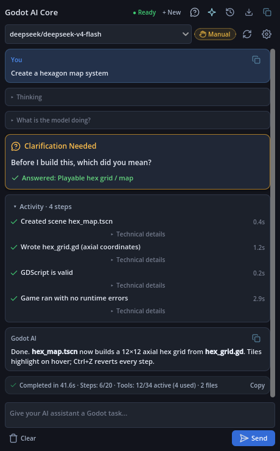
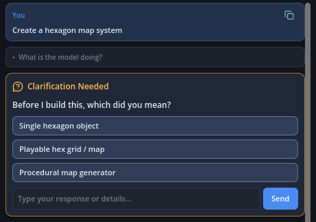
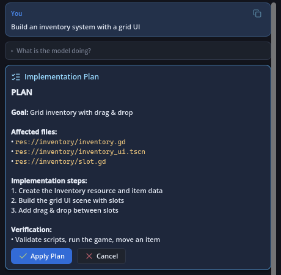
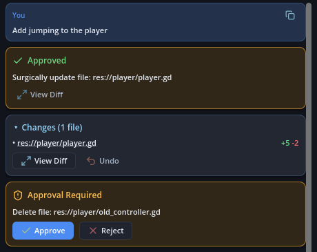
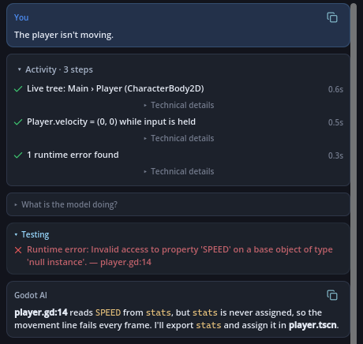

# Godot AI Sidebar

**An AI game-development agent that lives inside the Godot 4 editor.**

It is not a chat window that happens to sit next to your project. It reads your
scene tree and selection, asks before guessing, edits scripts surgically, records
every change in Godot's own undo history, and can inspect the game *while it is
running*.

[](#)
[](#)
[](LICENSE)
[](#testing)

**English** · [Türkçe](README.tr.md)

<p align="center">
  
</p>
<p align="center"><sub>Screenshots are rendered from the plugin's real UI components by <code>tools/readme_shots.gd</code>. The conversation in them is scripted, not a recorded model session.</sub></p>

---

## What it does

### Ask, and it asks back

Most coding assistants do exactly what you literally said. Ask for a "hexagon"
and you get one `MeshInstance3D`. Ask this one and it recognises that "hexagon"
could mean three very different things, and stops to find out.

<p align="center">
  
</p>

```text
You:  "Create a hexagon map system"

Godot AI:  Before I build this, which did you mean?
           [ Single hexagon object ]
           [ Playable hex grid / map ]
           [ Procedural map generator ]

You:  [ Playable hex grid / map ]

Godot AI:  → writes the scene (.tscn)
           → writes the grid script (GDScript)
           → validates the script before it touches disk
           → attaches it and runs verification
           → reports back with a structured result
```

It deliberately does **not** ask about trivialities (colour, size, naming). It
only interrupts when the answer would change the architecture. This is a
first-class agent state (`WAITING_FOR_CLARIFICATION`), not a prompt trick.

> Implemented as the `ask_user` tool plus the `ClarificationCard` UI.
> Covered by `tests/test_agent_clarification.gd`.

### It understands where you are

Whatever scene is open, whatever node you have selected, whatever script is in
the editor — that context is collected and given to the model automatically.
You do not have to paste your scene tree into the chat.

### It edits scripts surgically

For a one-line change in a 400-line script, it does not rewrite the file. It
replaces the specific block, shows you a line-level diff, and validates the
GDScript *before* anything is written to disk. So a broken edit is caught while
it is still a proposal.

> Tools: `replace_file_content` (surgical), `read_script`, `validate_script`.

### It plans before big changes

When a request is system-sized ("build an inventory system", "create a hex map
system"), the agent first proposes a plan: the goal, the files it will touch,
the steps and how it will verify the result. Until you press **Apply Plan**,
every tool that could modify your project is blocked in code, not just
discouraged in the prompt. Small edits ("set speed to 300") skip this and run
directly.

<p align="center">
  
</p>

Once approved, a task checklist follows the plan step by step as tools
complete, so you can see which step is running and where it stopped.

> Implemented by `PlanningPolicy` (the gate), `PlanCard` and `TaskChecklist`.

### You can undo everything

Every scene and node mutation — added nodes, deleted nodes, property changes,
signal connections, attached scripts, reparenting, renames — goes through
Godot's own `EditorUndoRedoManager`. **Ctrl+Z works exactly as it does for
edits you made by hand.** There is no separate "AI undo" that leaves your scene
in a state the editor cannot reason about.

<p align="center">
  
</p>

### It can look at the running game

This is the part that is genuinely hard to find elsewhere. The plugin registers
an `EditorDebuggerPlugin` and an autoload bridge, so the agent can query the
**live** scene tree of the game that is currently executing — not the saved
scene, the running one.

```text
You:  "The player isn't moving."

Godot AI:  → inspect_runtime_tree   (what actually exists at runtime?)
           → inspect_runtime_node   (what are the player's real values?)
           → get_runtime_errors     (what did the engine complain about?)
           → maps the stack trace back to the source file
           → proposes a fix
```

<p align="center">
  
</p>

Runtime stack traces are mapped back to real project files by a source mapper,
which is what lets the self-healing loop fix the *right* script.

> Tools: `inspect_runtime_tree`, `inspect_runtime_node`, `get_runtime_errors`,
> `play_game`, `stop_game`, `restart_game`, `take_runtime_screenshot`.

The agent can also **drive and measure** the running game, not just look at it:

- **`send_input`** plays a whole input sequence in one call (`steps`), holds
  several actions together, clicks nodes and drags; every result lists the script
  errors the game raised during the action.
- **`wait_for_runtime`** waits inside the game until a node property meets a
  condition (`==`, `>=`, `contains`, `exists` …); with a zero timeout it is an
  instant assertion.
- **`get_runtime_performance`** samples FPS, frame time and node / orphan growth
  (a growing node count means a leak); **`trace_runtime_signals`** records which
  signals fired and when. **`audit_runtime_ui`** measures on-screen text:
  off-screen or overflowing text, overlapping labels and low contrast against
  the pixels behind it. **`diagnose_physics`** finds why a trigger or hit box does
  nothing: layer / mask mismatches, disabled shapes, monitoring off. **`set_runtime_property`** injects a value into the running
  game (score 99, health 0) to test win / game-over states without playing for minutes.
- **`get_output`** reads Godot's Output (terminal) log: what the editor printed
  (autoload, import, plugin errors) and the game's `print()` lines. Secrets are
  masked.
- A script error no longer freezes the agent's game in the debugger, and errors
  are read from the game itself (the log file is locked while it runs).

### It respects your permissions

Not every operation should happen silently. A path policy blocks traversal
outside the project and protects sensitive files (`project.godot`,
`export_presets.cfg`, `.git/**`, and the plugin's own source). Write and delete
operations can require explicit approval through an inline card, with three
modes: **MANUAL**, **AUTO**, **FULL_AUTO**.

### New in v3

- **Goal mode (`/goal`)** — give an objective; the agent works round by round
  until it is met with evidence, then reports.
- **Skills and rules** — ready-made Godot recipes (`SKILL.md`, `/skill`) and
  standing instructions from `AGENTS.md` (`/learn` adds one).
- **`validate_project`** — compiles every script in the real project context and
  lists each error with file, line and message.
- **Several providers side by side** — 9Router, OpenRouter, OpenCode Zen, Ollama,
  LM Studio … are kept as profiles shared by every project (stored once in your
  editor's user folder); switch from the model bar. Thinking models get a
  per-profile *reasoning effort* setting.
- **Writes that survive mistakes** — only a syntax error blocks a write; code that
  parses but does not compile yet is written and reported, and a batch is applied
  file by file, so one bad file no longer discards the rest. The task is not
  reported done while a written file still fails to compile.
- **`file_info`, `find_files`, `search_code`** — exact-path check, name / path
  pattern search and content search, three separate lookups.
- **`send_input`** — presses keys, triggers input actions and clicks nodes in the
  running game.
- **Report a bug (`/bug`)** — builds a local zip with environment, masked
  settings, chat log and a panel screenshot; nothing is sent automatically.
- **Context meter** — how full the model's context is, from the provider's own
  token counts; older steps are summarized past 80%.
- **Redesigned interface** that follows the editor's light / dark theme and scale.

### And the practical stuff

- **Live token streaming** over SSE, so the answer appears as it is written.
- **`@mention`** autocompletion to pull a specific file or scene node into context.
- **Queued messages** — keep typing while the agent is working; tasks run in order.
- **Persistent chat history** in `user://sidebar_ai_chats/`, with search, rename
  and delete. API keys are never written to a session file.
- **`/` slash commands** — `/analyze`, `/debug`, `/fix`, `/inspect`, `/review`,
  `/run`, `/test`, `/clear`, `/help`, `/goal`, `/skill`, `/learn`, `/mcp`, `/bug`.
- **Undo/redo-safe multi-step plans** with loop protection, so a stuck agent
  stops instead of burning your tokens.
- **Turkish / English UI**, switchable at runtime.

---

## Quick Start

**1. Get the plugin**

Download the latest release archive from
[**Releases**](https://github.com/halilogia/Godot-AI-Sidebar/releases), or
clone this repository.

**2. Put it in your project**

The archive contains an `addons/` folder. Copy it so your project looks like:

```text
your_godot_project/
└── addons/
    └── godot_sidebar_ai/
        ├── plugin.cfg
        ├── plugin.gd
        └── ...
```

**3. Enable it**

In Godot: **Project → Project Settings → Plugins** → tick **Godot AI Sidebar**.

**4. Choose where the AI comes from**

Open the sidebar's settings and pick a provider. This is the one step people get
stuck on, so it is covered in detail in the next section.

**5. Try it**

Open any scene, then type:

```text
Analyse this project and tell me what it does.
```

> **Not sure which provider to pick?** If you already run
> [9Router](https://github.com/) locally, the defaults work out of the box. If
> you have an OpenAI-compatible API key, use that. If you want a sanctioned
> Antigravity session with no API key at all, use the AGY CLI provider.

---

## User guide

The full, step-by-step guide covers the panel, every slash command, `@` mentions, goal mode,
rules, skills, the MCP bridge and settings: **[docs/USER_GUIDE.en.md](docs/USER_GUIDE.en.md)**
(Türkçe: [docs/USER_GUIDE.md](docs/USER_GUIDE.md)). Inside the editor, the **Help** (?) button
in the panel header shows the same essentials, with the command list generated from the plugin.

## Claude Code plugin (one line)

Install the skills and the connector into Claude Code (any project, any machine):

```bash
claude plugin marketplace add halilogia/Godot-AI-Sidebar && claude plugin install godot-ai-sidebar@godot-ai-sidebar
```

You get 7 Godot 4 skills (runtime verification, visual polish with a look recipe for each of 11 game genres, scene authoring, feature development, debugging, refactoring, headless CI) and the `/godot-connect` command. In a project that has the sidebar plugin enabled, run `/godot-connect` once: it reads the bridge port and token from the project's config and registers the MCP server for you. Restart Claude Code, keep the Godot editor open, and Claude can play, measure and screenshot your running game.

## Use it from Claude Code (MCP)

External agents such as **Claude Code** can drive the open Godot editor through the
plugin's tool layer (Model Context Protocol). The agent keeps its own terminal, git and
web research; the plugin gives it Godot's eyes and hands: scene tree and node
inspection, script validation, re-scanning files it wrote (`sync_project`), running and
stopping the game, runtime errors and live scene tree, editor/runtime screenshots.

**What the bridge exposes (39 tools):** project and scene reading, `validate_project`,
`sync_project`, `play_game` / `stop_game`, `send_input` (keys, actions, clicks, drags),
`wait_for_runtime`, runtime tree and node inspection, screenshots, `get_output`
(editor and game log), `get_runtime_performance`, `trace_runtime_signals`, and three
measuring tools: **`audit_runtime_ui`** (off-screen, overflowing, overlapping and
low-contrast text), **`diagnose_physics`** (collision layer / mask mismatches, disabled
shapes, dead triggers) and **`set_runtime_property`** (inject a value into the running
game to test win / game-over states). Every tool carries MCP `annotations`
(`readOnlyHint` etc.), so clients can skip approval prompts for tools that only observe.

**Protocol:** the bridge speaks the MCP **2026-07-28** specification (stateless requests,
`server/discover`, `Mcp-Method` / `Mcp-Name` / `MCP-Protocol-Version` header checks,
`resultType`, cacheable `tools/list`, `structuredContent`) and still answers the older
`initialize` handshake (2025-03-26 to 2025-11-25), so current and older clients both work.

**Faster: Claude Code plugin.** Instead of pasting the command, install the
[plugin](#claude-code-plugin-one-line) and run `/godot-connect` in your project.

1. Open **Settings → External Agent (MCP)** and press **Turn on** (or type `/mcp on`). The
   bridge starts on `127.0.0.1`; **Copy Claude Code connect command** copies the command.
2. In a terminal, in your **game project's** folder, paste it. It looks like:

   ```bash
   claude mcp add --transport http godot http://127.0.0.1:6570/mcp --header "Authorization: Bearer <token>"
   ```

3. Start `claude` there and ask it to work on the game, e.g. *"Use the godot tools: read
   the scene tree, write the player script, call sync_project, run the game and check
   runtime errors and a screenshot."*

The bridge only listens on this machine, requires the secret token, rejects browser
requests and goes through the same permission and path policies as the in-editor agent.
The agent writes files itself and then calls `sync_project`; small changes in the open
scene (with Ctrl+Z undo) are also available. Turn it off in the same page or with `/mcp off`.

## Providers

The plugin talks to two families of backend. This is the most common source of
setup confusion, so here is the honest breakdown:

| | **OpenAI-compatible** | **Antigravity CLI** |
| :--- | :--- | :--- |
| **How it works** | HTTP + SSE | Spawns the `agy` CLI as a persistent subprocess |
| **Setup** | Base URL + API key | `agy` on your `PATH`, logged in |
| **Works with** | 9Router, OpenRouter, Ollama, LM Studio, any OpenAI-shaped endpoint | Official Google Antigravity CLI |
| **Streaming** | Yes | Yes |
| **Tool calling** | Yes (native) | Yes (JSON-in-text protocol) |
| **Vision / images** | Yes, for vision-capable models | **No** |
| **Best for** | Most users; local models; image analysis | Users who want an Antigravity session without managing a key |

### Vision support is model-dependent

`supports_vision()` decides whether image input is allowed. It respects an
explicit `vision_capable` override in your config; otherwise it infers from the
model id. Models whose capability it does not recognise are **allowed through**
rather than blocked — if your backend cannot actually handle the image, the
error will come from the server, which is a better authority than a guess.

### The defaults

Out of the box the config points at 9Router:

```json
{
  "provider_type": "openai_compatible",
  "base_url": "http://localhost:20128/v1",
  "selected_model": "a"
}
```

> [!NOTE]
> `addons/godot_sidebar_ai/config.json` is **gitignored**, so your key stays
> local. Do not commit it, and do not un-ignore it.

---

## Safety

The agent can edit your project, so it is built to be interruptible and
reversible.

**Protected paths** — the path policy refuses to touch these, regardless of what
the model asks for:

```text
res://project.godot          engine settings
res://export_presets.cfg     export settings
res://.git/**                version control
res://addons/godot_sidebar_ai/**   the plugin's own source
```

Path traversal (`../`) is stripped using an array-stack normaliser rather than
string matching.

**Approval modes** — you choose how much autonomy to grant:

| Mode | Behaviour |
| :--- | :--- |
| `MANUAL` | Writes and deletes require your approval each time |
| `AUTO` | Safe edits proceed; destructive operations still ask |
| `FULL_AUTO` | The agent runs unattended |

**Verification before writing** — GDScript is compiled and validated before it
reaches disk, so a syntax error is caught while it is still a proposal you can
reject.

---

## Runtime Intelligence

Most tools operate on your *saved* project. This one can also observe the game
that is actually running, through a debugger bridge:

```text
Editor process                    Game process
──────────────                    ────────────
EditorDebuggerPlugin   ⇄  runtime_bridge (autoload)
        ↓                          ↓
runtime_observer  ←────  live scene tree, node values, errors
        ↓
source_mapper  →  maps stack traces to real files
        ↓
agent_context  →  the model sees what is actually broken
```

This is what makes "why isn't the player moving?" a question the agent can
actually answer, instead of one it has to guess at.

---

## Architecture

The project follows Clean Architecture with strict single-responsibility
per file. The dependency direction always points inward, and the UI layer never
touches the network directly.

```mermaid
graph TD
    subgraph UI ["Presentation (ui/)"]
        ChatDock["chat_dock.gd"]
        Components["MessageBubble / ApprovalCard / ClarificationCard"]
        Theme["sidebar_theme.gd"]
    end

    subgraph Application ["Application (core/agent, core/chat)"]
        AgentRunner["agent_runner.gd"]
        AgentContext["agent_context.gd"]
        Compactor["context_compactor.gd"]
        ChatManager["chat_manager.gd"]
    end

    subgraph Domain ["Domain (core/tools, mutations, security)"]
        ToolManager["tool_manager.gd"]
        Mutations["editor_mutation_service.gd"]
        Pipeline["verification_pipeline.gd"]
        PathPolicy["path_policy.gd"]
    end

    subgraph Runtime ["Runtime (core/runtime)"]
        Debugger["debugger_plugin.gd"]
        Bridge["runtime_bridge.gd"]
        Mapper["source_mapper.gd"]
    end

    subgraph Infra ["Infrastructure (core/network, providers)"]
        Provider["ai_provider.gd"]
        OpenAI["openai_compatible_provider.gd"]
        AGY["agy_cli_provider.gd"]
        Network["network_manager.gd"]
    end

    ChatDock --> AgentRunner
    ChatDock --> Components
    ChatDock -.-> Theme
    AgentRunner --> AgentContext
    AgentRunner --> ToolManager
    AgentRunner --> Provider
    AgentContext --> Compactor
    AgentContext --> ChatManager
    ToolManager --> Mutations
    ToolManager --> Pipeline
    ToolManager --> PathPolicy
    OpenAI --|> Provider
    AGY --|> Provider
    OpenAI --> Network
    Debugger --> Bridge
    Bridge --> Mapper
    Mapper --> AgentContext
```

The full breakdown — every layer, every class, and the complete file tree — is in
[**ARCHITECTURE.md**](ARCHITECTURE.md).

### Notable design decisions

- **Headless preload rule.** Godot's CLI does not populate the global
  `class_name` registry, so scripts reference each other with
  `const X = preload("res://...")`. This makes the whole codebase runnable under
  `godot --headless`, which is what makes the test suite possible.
- **Context compaction.** In long multi-step tasks, tool outputs older than two
  steps are condensed into one-line summaries, while the two most recent tools
  keep their full payload. This keeps token usage flat without losing the data
  the agent is actively working on.
- **Resilient SSE.** Some backends end a stream by sending
  `finish_reason: "stop"` and closing the socket without a `data: [DONE]`
  sentinel. That socket close surfaces as `STATUS_CONNECTION_ERROR (8)`, which
  is treated as a successful completion rather than a failure, so no content is
  lost.

---

## Testing

The plugin has a headless test suite and a static compile validator. Both run
without opening the editor.

```bash
# 0. One command: typecheck + full test suite (add -Live for the 9Router test)
powershell -ExecutionPolicy Bypass -File .\verify.ps1

# 1. Static compile & scene-load check (addons/ + tests/)
powershell -ExecutionPolicy Bypass -File .\typecheck.ps1

# 2. Full test suite
godot --headless --path . -s "res://tests/test_runner.gd"

# 3. Live provider integration test (requires 9Router on 127.0.0.1:20128)
godot --headless --path . -s "res://tests/integration/test_real_9router_live.gd"
```

> [!IMPORTANT]
> The suite is designed to pass on a **clean checkout**, with no
> `config.json` present. Tests must not depend on your local provider settings —
> a test that only passes on the author's machine is worse than no test.

The live integration test is the only thing that proves real network behaviour;
the in-memory provider tests prove internal logic only.

---

## Roadmap

Currently shipped (v3.0.0): core architecture, undo/redo mutations, surgical
editing, streaming SSE, `@mention`, chat persistence, clarification, UI
telemetry, runtime inspection and input, the MCP bridge for external agents,
skills and rules, goal mode, `validate_project`, bug reports and the context
meter.

Next: final verification of v3 in the real editor and a benchmark run, then
sub-agents.

See [**ROADMAP.md**](ROADMAP.md) for the full phase-by-phase breakdown, and
[**CHANGELOG.md**](CHANGELOG.md) for what changed in each version.

---

## Known limitations

Stated plainly, because you will find them anyway:

- **AGY CLI first-run latency.** Starting an `agy` session can block the editor
  briefly while the subprocess initialises its stdio pipes. A pre-warm pass
  mitigates this, but the write to the subprocess still happens on the main
  thread. This is under active investigation.
- **No vision via AGY CLI.** The `agy` stream-json interface does not accept
  image data. Use an OpenAI-compatible provider for image analysis.
- **Godot 4.7+ only.** The plugin uses `EditorInterface` singleton APIs and is
  not expected to work on 4.2 or earlier.
- **GDScript projects only.** C# scripting is not supported.

---

## Contributing

Issues and pull requests are welcome. For questions and setup help, please use
[**Discussions**](https://github.com/halilogia/Godot-AI-Sidebar/discussions)
rather than the issue tracker.

Before opening a PR, please make sure both of these pass:

```bash
powershell -ExecutionPolicy Bypass -File .\typecheck.ps1
godot --headless --path . -s "res://tests/test_runner.gd"
```

The screenshots in `docs/media/` are generated from the real UI components. If
you change the UI, regenerate them (English and Turkish):

```bash
godot --path . -s res://tools/readme_shots.gd -- docs/media en
godot --path . -s res://tools/readme_shots.gd -- docs/media tr
# On a headless Linux server, prefix with: xvfb-run -a  (and add --rendering-driver opengl3)
```

The full development workflow (verification steps, warning ratchet, test isolation, live test, CI) is in [**docs/DEVELOPMENT.md**](docs/DEVELOPMENT.md).

If you are an AI agent working on this repository, read
[**AGENTS.md**](AGENTS.md) first — it contains the architecture rules and the
project's evidence standards.

---

## License

**GNU General Public License v3.0 (GPL-3.0)** — see [LICENSE](LICENSE).

Copyright (C) 2026 Halil Emre.
