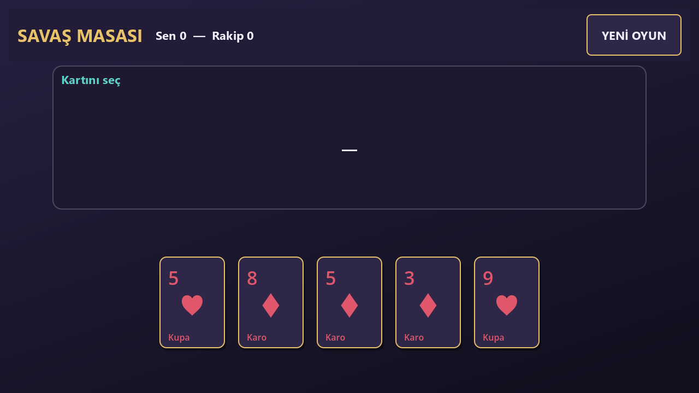
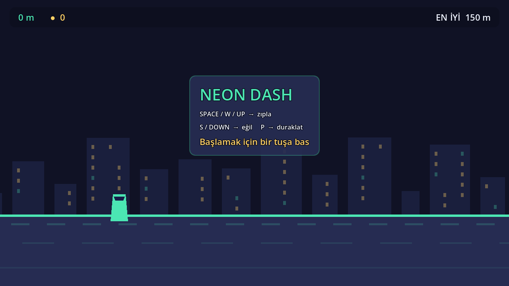
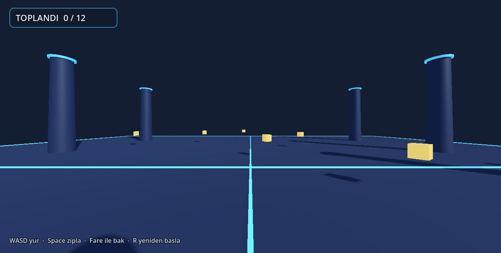
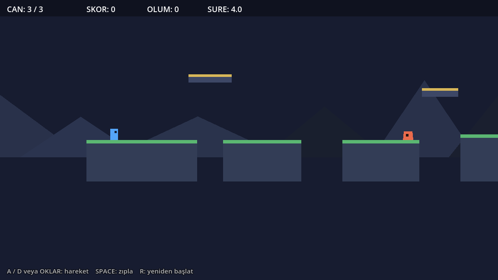
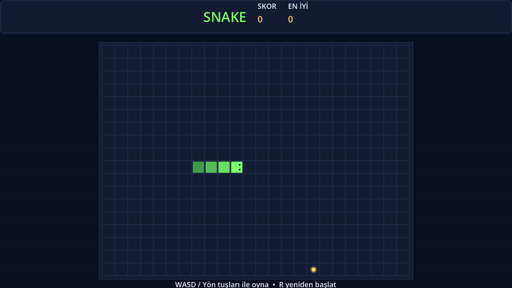
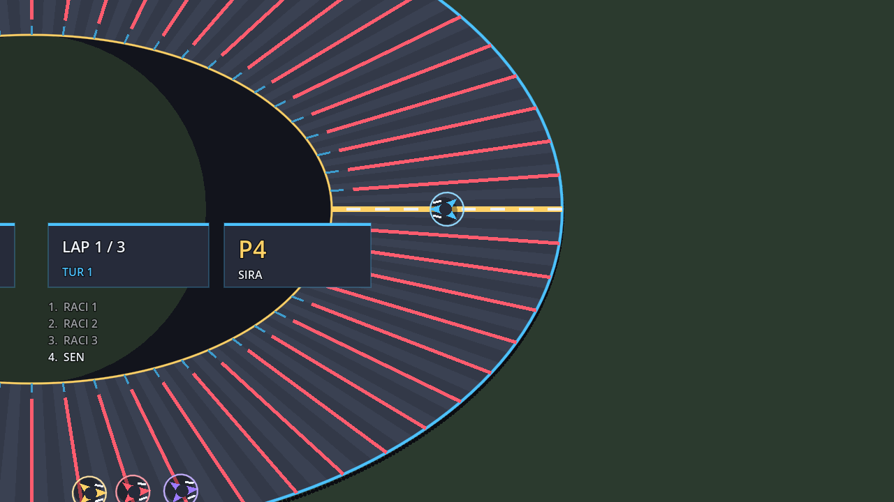
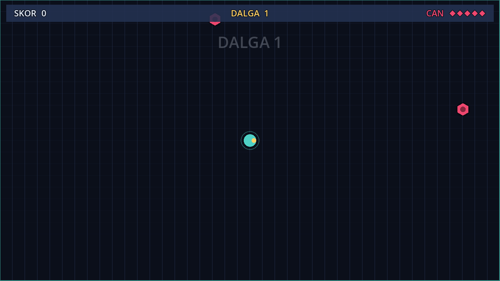
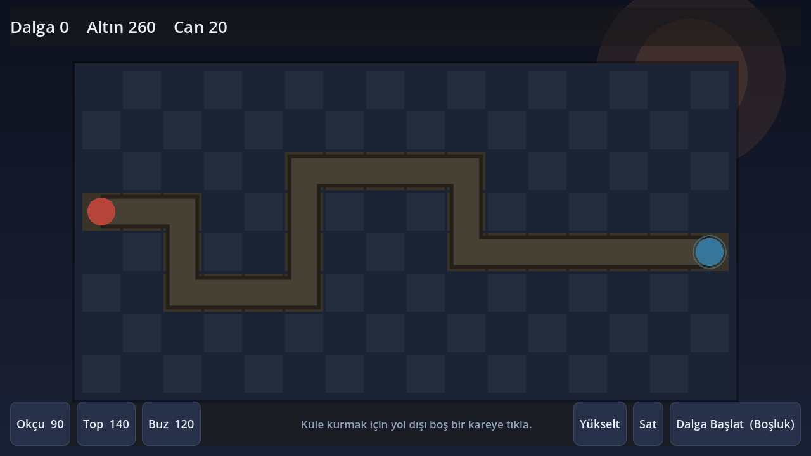

# Demo kütüphanesi

Her demo, boş bir projede tek bir istemle **Godot AI Sidebar ajanının kendisi** tarafından yazıldı (`tools/demo_bench.ps1`); insan eli değmedi. İstem ve ölçüm her demonun `BENCH/` klasöründe.

Açmak için: klasörü Godot 4.7'de aç ve eklentiyi `scripts/sync-example.ps1` ile bağla.

| Tür | İstem | Süre | Adım | Araç | Tarih |
|---|---|---|---|---|---|
| [Endless runner](endless-runner/) | endless runner oyun demosu yap | 7 dk | 60 | 69 | 2026-09-29 |

## Galeri

## Galeri
| [Platformer](platformer/) | platformer oyun demosu yap | 5 dk | 57 | 56 | 2026-09-29 |

## Galeri

## Galeri
| [Top-down yarış](topdown-racing/) | top-down yarış oyunu demosu yap | 9.1 dk | 81 | 90 | 2026-09-29 |

## Galeri
| [3D birinci şahıs](fps-3d/) | 3D birinci şahıs yürüme ve toplama demosu yap | 2.4 dk | 24 | 37 | 2026-09-29 |

## Galeri
| [Kart oyunu](card-game/) | kart oyunu demosu yap | 5.9 dk | 66 | 68 | 2026-09-29 |

## Galeri

## Galeri
| [Snake](snake/) | snake oyunu demosu yap | 4.5 dk | 51 | 57 | 2026-09-29 |

## Galeri
| [Tower defense](tower-defense/) | tower defense oyun demosu yap | 9.1 dk | 85 | 92 | 2026-09-29 |

## Galeri
| [Top-down shooter](topdown-shooter/) | top-down shooter demosu yap | 4.9 dk | 56 | 69 | 2026-09-29 |

## Galeri

<!-- galeri -->
**card-game**

**endless-runner**

**fps-3d**

**platformer**

**snake**

**topdown-racing**

**topdown-shooter**

**tower-defense**

<!-- /galeri -->
